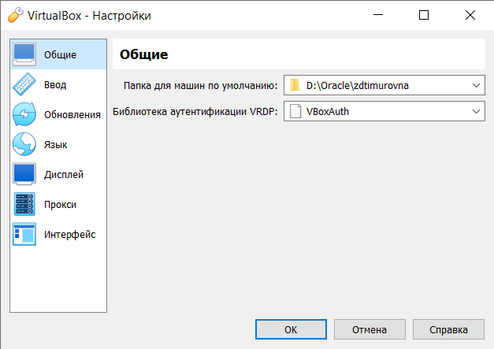
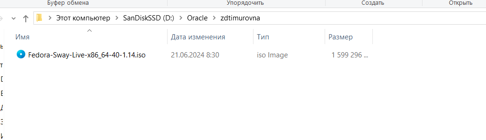
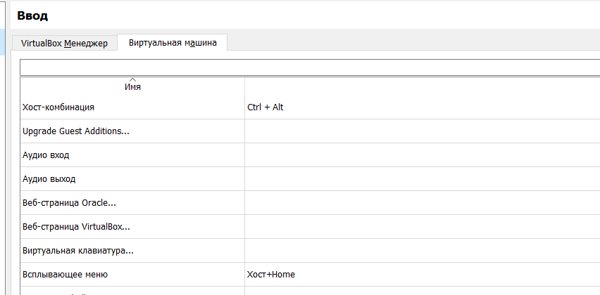
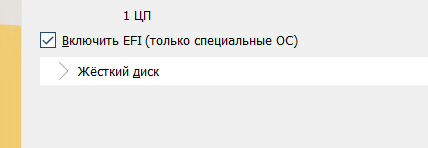
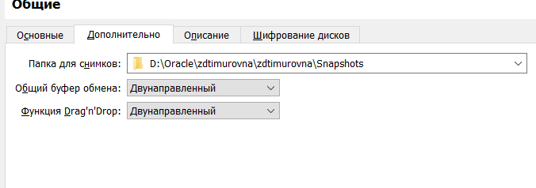
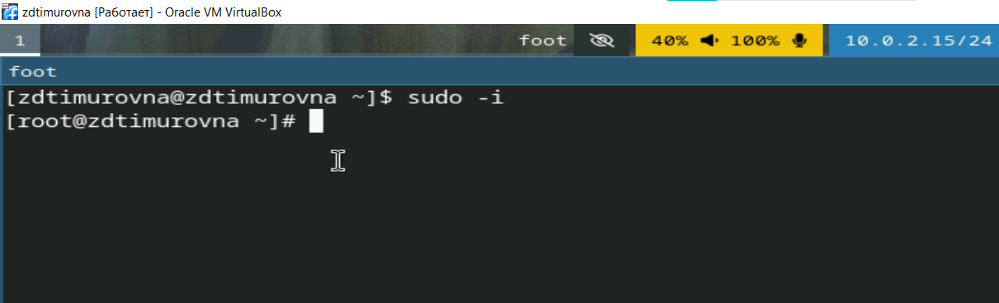
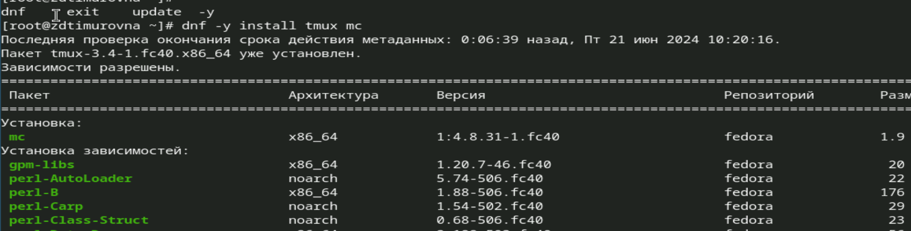
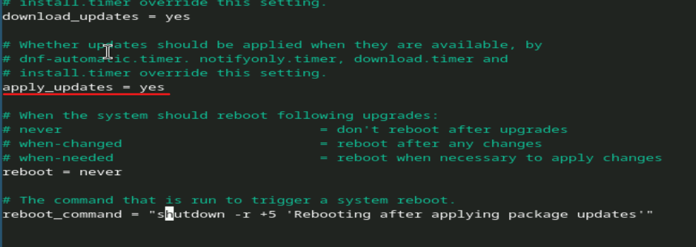
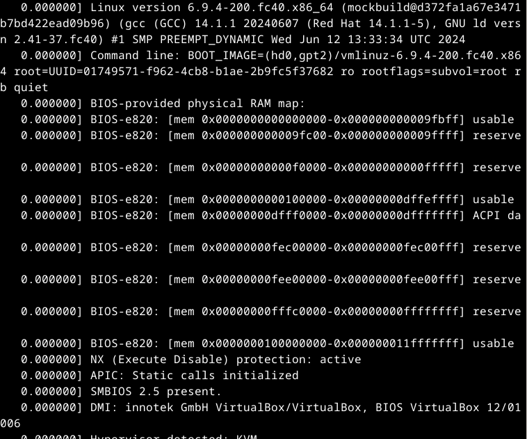

---
## Front matter
title: "Отчёт по лабораторной работе №1"
subtitle: "Дисциплина: Операционные Cистемы"
author: "Зуева Дарья Тимуровна, НПМбв-01-20"

## Generic otions
lang: ru-RU
toc-title: "Содержание"

## Bibliography
bibliography: bib/cite.bib
csl: pandoc/csl/gost-r-7-0-5-2008-numeric.csl

## Pdf output format
toc: true # Table of contents
toc-depth: 2
lof: true # List of figures
lot: true # List of tables
fontsize: 12pt
linestretch: 1.5
papersize: a4
documentclass: scrreprt
## I18n polyglossia
polyglossia-lang:
  name: russian
  options:
	- spelling=modern
	- babelshorthands=true
polyglossia-otherlangs:
  name: english
## I18n babel
babel-lang: russian
babel-otherlangs: english
## Fonts
mainfont: PT Serif
romanfont: PT Serif
sansfont: PT Sans
monofont: PT Mono
mainfontoptions: Ligatures=TeX
romanfontoptions: Ligatures=TeX
sansfontoptions: Ligatures=TeX,Scale=MatchLowercase
monofontoptions: Scale=MatchLowercase,Scale=0.9
## Biblatex
biblatex: true
biblio-style: "gost-numeric"
biblatexoptions:
  - parentracker=true
  - backend=biber
  - hyperref=auto
  - language=auto
  - autolang=other*
  - citestyle=gost-numeric
## Pandoc-crossref LaTeX customization
figureTitle: "Рис."
tableTitle: "Таблица"
listingTitle: "Листинг"
lofTitle: "Список иллюстраций"
lotTitle: "Список таблиц"
lolTitle: "Листинги"
## Misc options
indent: true
header-includes:
  - \usepackage{indentfirst}
  - \usepackage{float} # keep figures where there are in the text
  - \floatplacement{figure}{H} # keep figures where there are in the text
---

# Цель работы

Целью данной работы является приобретение практических навыков установки операционной системы на виртуальную машину, настройки минимально необходимых для дальнейшей работы сервисов.

# Задание

1. Настройка каталога для виртуальных машин
2. Смена Хост-комбинации в настройках VirtualBox 
3. Создание ВМ 
4. Установка операционной системы 
5. Автоматическое обновление 
6. Отключение SELinux 
7. Установка драйверов для VirtualBox 
8. Настройка раскладки клавиатуры 
9. Изменение имени хоста 
10. Подключение общей папки 
11. Работа с языком разметки Markdown 
12. Установка texlive 
13. Домашнее задание 
14. Контрольные вопросы

# Выполнение лабораторной работы
## 1. Настройка каталога для виртуальных машин
Для выполнения лабораторной работы №1 в качестве хостовой системы использовалась ОС Windows 10 и создание папок происходило при помощи графического интерфейса.

Для создания папки с учетной записью студента был использован внешний SSD диск, на котором будут располагаться файлы виртуальной машины:
{#fig:001 width=70%}

Редактирование пути по умолчанию к папкам виртуальных машин Virtualbox:
{#fig:001 width=70%}

Для проверки установленных устройств запустим через командную строку VboxManage и проверим какая папка по умолчанию стоит:  
```shell
.\VBoxManage.exe list systemproperties | findstr "Default machine folder:" 
```
{#fig:001 width=70%}

Смена пути произошла успешно, при помощи графического интерфейса.
Выведем только каталог по умолчанию из настроек VirtualBox, при помощи команды:
```shell
vboxmanage list systemproperties | grep "Default machine folder:" | cut -d":" -f2 | tr -d ' ' 
```
Команда написана под Linux, и из-под Windows выглядит следующим образом:
```shell
for /f "tokens=3 delims=:" %i in ('.\VboxManage list systemproperties ^| findstr /c:"Default machine folder:"') do @echo %i | powershell -Command "$input.trim()"
```
{#fig:001 width=70%}

Перенесем установочный образ в папку. Перенесенный файл расположен в папке с именем учетной записи студента:
{#fig:001 width=70%}

## 2. Смена Хост-комбинации в настройках VirtualBox 
Мною была выбрана удобная для меня комбинация Ctr+Alt. Смена происходила через графический интерфейс VirtualBox. 
{#fig:001 width=70%}

## 3. Создание ВМ 
Для создания также использовался графический интерфейс Virtualbox. Зададим основные настройки ВМ, такие как название, образ ISO:
{#fig:001 width=70%}

Далее нужно задать размер оперативной памяти, а также количество процессоров:
{#fig:001 width=70%}

Также нужно поставить галочку напротив пункта “Включить UEFI”:
{#fig:001 width=70%}

Последним шагом будет выделение места на диске под виртуальную машину:
{#fig:001 width=70%}

Так как при установке ВМ использовался графический интерфейс, автоматически добавился контроллер IDE и контроллер SATA(vdi-диск):
{#fig:001 width=70%}

Включим 3D-ускорение и поставим использоваться VMSVGA графический контроллер:
{#fig:001 width=70%}

Далее включим общий буфер обмена и функцию Drag’n’ Drop:
{#fig:001 width=70%}

## 4. Установка операционной системы 
После запуска ВМ появляется меню запуска. В нем выбираем полноценный запуск Fedora:
{#fig:001 width=70%}

После загрузки появляется рабочий стол и инструкции по настройке системы. 
Установщик Anaconda открывается комбинацией клавиш `Win` + `Enter` и командой `liveinst` в открывшемся терминале:
{#fig:001 width=70%}

При настраивании клавиатуры были выбраны языки английский и русский, а также сменила комбинацию клавиш смены языка на `Ctrl` + `Shift`. 

Также был скорректирован часовой пояс, а дата и время оставлено на автоматическое получение через NTP:
{#fig:001 width=70%}

Настроим аккаунт администратора (`root`):
{#fig:001 width=70%}

Настроим аккаунт пользователя:
{#fig:001 width=70%}

Настроим сетевое имя ВМ:
{#fig:001 width=70%}

Имя узла после нажатия кнопки “Применить” не поменялось. Оно будет изменено далее при помощи терминала.

После перезагрузки системы, в терминале получаем root права при помощи `sudo -i`:
{#fig:001 width=70%}

Обновляем все пакеты командой `dnf -y update`:
{#fig:001 width=70%}

После этого производим установку `tmux` и `mc`:
{#fig:001 width=70%}

## 5. Автоматическое обновление 
Используя команду `dnf install dnf-automatic`, установим ПО для автоматического обновления пакетов системы:
{#fig:001 width=70%}

Следующим шагом будет настройка конфигурационного файла `/etc/dnf/automatic.conf`. В нем меняем значение поля `apply_update`:
{#fig:001 width=70%}

После чего включаем таймер:
{#fig:001 width=70%}

## 6. Отключение SELinux 
Для отключения SELinux нужно зайти в конфигурационный файл `/etc/selinux/config` и изменить `SELINUX=enforcing` на `SELINUX=permissive`:
{#fig:001 width=70%}

## 7. Установка драйверов для VirtualBox 
Для установки драйверов для VBox заходим в терминал под суперпользователем и применяем установочную команду `dnf -y group install "Development Tools"`:
{#fig:001 width=70%}

Далее установим `dkms` при помощи `dnf install dkms`:
{#fig:001 width=70%}

После чего монтируем диск командой `mount /dev/sr0 /media` и запускаем файл `VBoxLinuxAdditions.run`:
{#fig:001 width=70%}

## 8. Настройка раскладки клавиатуры 
Далее создадим файл для конфигурации клавиатуры - `touch ~/.config/sway/config.d/95-system-keyboard-config.conf`.
Изменим конфигурационный файл `/etc/X11/xorg.conf.d/00-keyboard.conf`:
{#fig:001 width=70%}

После чего просто перезагружаем машину с помощью `reboot`.
## 9. Изменение имени хоста 
{#fig:001 width=70%}

## 10. Подключение общей папки 
Для начала добавим своего пользователя в группу vboxsf через `gpasswd -a zdtimurovna vboxsf`:
{#fig:001 width=70%}

Далее в графическом интерфейсе добавим хостовую папку в общую с ВМ:
{#fig:001 width=70%}

## 11. Работа с языком разметки Markdown 
Установим pandoc:
{#fig:001 width=70%}

## 12. Установка texlive 
Команда для установки `dnf -y install texlive-scheme-full`:
{#fig:001 width=70%}

## 13. Домашнее задание 
Вывод  команды `dmesg | less`:
{#fig:001 width=70%}

Версия ядра Linux:
{#fig:001 width=70%}

Частота процессора:
{#fig:001 width=70%}

Модель процессора:
{#fig:001 width=70%}

Объём доступной оперативной памяти:
{#fig:001 width=70%}

Тип обнаруженного гипервизора:
{#fig:001 width=70%}

Тип файловой системы корневого раздела и последовательность монтирования файловых систем:
{#fig:001 width=70%}

## 14. Контрольные вопросы
### 1. Какую информацию содержит учётная запись пользователя?

Учётная запись пользователя содержит:
1. **Имя пользователя** (`username`): Уникальный идентификатор пользователя в системе.
2. **Пароль** (`password`): Пароль учётной записи пользователя.
3. **UID** (`User ID`): Уникальный числовой идентификатор пользователя. 
4. **GID** (`Group ID`): Уникальный числовой идентификатор основной группы пользователя.
5. **Домашний каталог** (`home directory`): Каталог, где пользователь хранит свои файлы. 
6. **Интерпретатор команд** (`shell`): Программа, которая исполняет команды пользователя. 
7. **Дополнительная информация**: Полное имя, контактная информация и другие персональные данные.

Эти данные обычно хранятся в `/etc/passwd`.

### 2. Укажите команды терминала и приведите примеры:

1. Для получения справки по команде:
```bash
man <команда>    	# Пример: man ls
<команда> --help 	# Пример: ls --help
```
2. Для перемещения по файловой системе:
```bash
cd <каталог>    # Пример: cd /home/user
cd ..           # Перемещение на уровень выше
cd              # Перемещение в домашний каталог  пользователя
```
3. Для просмотра содержимого каталога:
```bash
ls               # Пример: ls /home/user
ls -l            # Детализированный список с правами, владельцем и размером файлов
ls -a            # Показать все файлы, включая скрытые
```
4. Для определения объёма каталога:
```bash
du -sh <каталог> 		# Пример: du -sh /home/user
```
5. Для создания / удаления каталогов / файлов:
```bash
mkdir <каталог>      	# Пример: mkdir new_directory
rmdir <каталог>     	# Пример: rmdir old_directory
touch <файл>         	# Пример: touch new_file.txt
rm <файл>            	# Пример: rm old_file.txt
rm -r <каталог>      	# Пример: rm -r old_directory
```
6. Для задания определённых прав на файл / каталог:
```bash
chmod <права> <файл/каталог>    # Пример: chmod 755 script.sh
chown <владелец> <файл/каталог> # Пример: chown user:user file.txt
chgrp <группа> <файл/каталог>   # Пример: chgrp group file.txt
```
7. Для просмотра истории команд:
```bash
history
```
### 3. Что такое файловая система? Приведите примеры с краткой характеристикой.
**Файловая система** — это метод и структура данных, используемые операционной системой для управления файлами на диске или разделе.

Примеры файловых систем:
- `ext4` (**Fourth Extended Filesystem**): Стандартная файловая система для многих дистрибутивов Linux, поддерживающая большие объёмы данных и журналы.
- `NTFS` (**New Technology File System**): Основная файловая система Windows, поддерживающая большие файлы и различные функции безопасности.
- `FAT32` (**File Allocation Table 32**): Широко используемая файловая система для внешних и съёмных носителей, но ограничена максимальным размером файла 4 ГБ.
- `HFS+` (**Hierarchical File System Plus**): Файловая система, используемая в macOS до появления APFS, поддерживающая журналы и большие объёмы данных.
- `APFS` (**Apple File System**): Новая файловая система для macOS, оптимизированная для SSD-дисков, с поддержкой шифрования и клонирования файлов.
### 4. Как посмотреть, какие файловые системы подмонтированы в ОС?
Для этого используется команды:
```bash
df -h
mount
```
### 5. Как удалить зависший процесс?
Для удаления зависшего процесса сначала нужно найти его PID (Process ID). Это можно сделать с помощью команды `ps` или `top`. Пример использования `ps` для поиска PID:
```bash
ps aux | grep <имя_процесса>
```
После нахождения PID, процесс можно завершить с помощью команды `kill`:
```bash
kill <PID>
```
Если процесс не завершился, можно использовать принудительное завершение:
```bash
kill -9 <PID> # Пример: kill -9 1234, где 1234 — это PID процесса.
```
# Вывод

В ходе выполнения данной лабораторной работы были получены практические навыки в установке и настройки ОС Fedora. А также получены навыки работы с установочными пакетами и их настройками для дальнейшей работы с ними.

# Список литературы{.unnumbered}

::: {#refs}
:::
