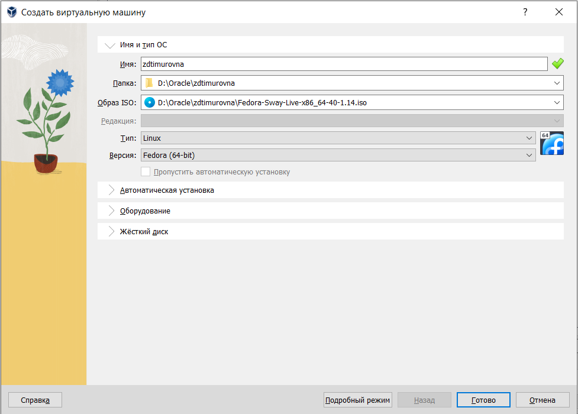
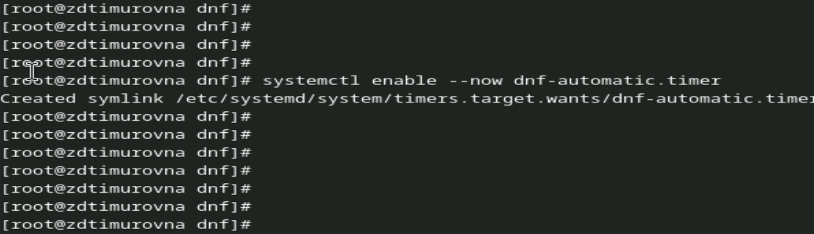

---
## Front matter
title: "Отчёт по лабораторной работе №1"
subtitle: "Дисциплина: Операционные Cистемы"
author: "Зуева Дарья Тимуровна, НПМбв-01-20"

## Generic otions
lang: ru-RU
toc-title: "Содержание"

## Bibliography
bibliography: bib/cite.bib
csl: pandoc/csl/gost-r-7-0-5-2008-numeric.csl

## Pdf output format
toc: true # Table of contents
toc-depth: 2
lof: true # List of figures
lot: true # List of tables
fontsize: 12pt
linestretch: 1.5
papersize: a4
documentclass: scrreprt
## I18n polyglossia
polyglossia-lang:
  name: russian
  options:
	- spelling=modern
	- babelshorthands=true
polyglossia-otherlangs:
  name: english
## I18n babel
babel-lang: russian
babel-otherlangs: english
## Fonts
mainfont: PT Serif
romanfont: PT Serif
sansfont: PT Sans
monofont: PT Mono
mainfontoptions: Ligatures=TeX
romanfontoptions: Ligatures=TeX
sansfontoptions: Ligatures=TeX,Scale=MatchLowercase
monofontoptions: Scale=MatchLowercase,Scale=0.9
## Biblatex
biblatex: true
biblio-style: "gost-numeric"
biblatexoptions:
  - parentracker=true
  - backend=biber
  - hyperref=auto
  - language=auto
  - autolang=other*
  - citestyle=gost-numeric
## Pandoc-crossref LaTeX customization
figureTitle: "Рис."
tableTitle: "Таблица"
listingTitle: "Листинг"
lofTitle: "Список иллюстраций"
lotTitle: "Список таблиц"
lolTitle: "Листинги"
## Misc options
indent: true
header-includes:
  - \usepackage{indentfirst}
  - \usepackage{float} # keep figures where there are in the text
  - \floatplacement{figure}{H} # keep figures where there are in the text
---

# Цель работы

Целью данной работы является приобретение практических навыков установки операционной системы на виртуальную машину, настройки минимально необходимых для дальнейшей работы сервисов.

# Задание

1. Установить VirtualBox. Установить новую виртуальную машину. Загрузить образ.
2. Установить операционную систему и произвести первичные настройки.
3. Обновить все пакеты.
4. Установить программы для удобства работы в консоли.
5. Настроить автоматическое обновление.
6. Отключить SELinux.
7. Установить драйверы для VirtualBox.
8. Настроить клавиатуру.
9. Установить имя пользователя.
10. Подключить общую папку.
11. Установка pandoc.
12. Установка texlive.

# Выполнение лабораторной работы

### 1. Установка VirtualBox и виртуальной системы. Загрузка образа.
Так как работа ведется на Linux Ubuntu, устанавливаю VirtualBox с помощью `sudo apt install virtualbox`.
{#fig:001 width=70%}
{#fig:001 width=70%}
Можно заметить, что в менеджере уже есть две виртуальные машины. Данные виртуальные машины не относятся к лабораторной работе и использоваться не будут.
С помощью GUI создаю новую виртуальную машину, Linux, Fedora(64-bit).
{#fig:001 width=70%}
Параметры моей виртуальной машины следующие:
{#fig:001 width=70%}
Включаю поддержку UEFI:
{#fig:001 width=70%}
Включаю общий буфер обмена и перетаскивание объектов между хостом и гостевой ОС:
{#fig:001 width=70%}

### 2. Установка операционной системы и первичная настройка
Скачиваю образ Fedora Sway Spin 40 с https://fedoraproject.org/spins/sway/download.
{#fig:001 width=70%}
Запускаю ОС через режим Troubleshooting и, после успешного результата, устанавливаю Fedora 40 с помощью Anaconda.
{#fig:001 width=70%}
Корректирую настройки (язык интерфейса, имена и пароли для учетных записей, сетевое имя и т.д.).
{#fig:001 width=70%}
Запускаю установку:
{#fig:001 width=70%}
После всех проделанных манипуляций делаю снапшот, выключаю машину и включаю заново, в уже загруженный образ. Машина грузится в настроенную ОС и первым делом показывает начальный экран с просьбой ввода данных пользователя.
{#fig:001 width=70%}
Перехожу в терминал и переключаюсь на супер-пользователя:
{#fig:001 width=70%}

### 3. Обновление пакетов
В терминале обновляю все пакеты командой `dnf -y update`.
{#fig:001 width=70%}

### 4. Повышение комфорта работы
Запускаю команду `dnf -y install tmux mc`:
{#fig:001 width=70%}
### 5. Настройка автоматического обновления
Устанавливаю программное обеспечение для автоматического обновления командой `dnf install dnf-automatic`:
{#fig:001 width=70%}
Смотрю конфигурацию `/etc/dnf/automatic.conf`. Меня в ней все устраивает, поэтому оставляю ее как она уже есть. Запускаю таймер:
{#fig:001 width=70%}

### 6. Отключение SELinux
Открываю `/etc/selinux/config` (я использую утилиту `nano`) и заменяю `SELINUX=enforcing` на `SELINUX=permissive`.
{#fig:001 width=70%}

Перезагружаю виртуальную машину командой `reboot`.

### 7. Установка драйверов для VirtualBox
После перезагрузки заново захожу в систему и открываю терминал. Запускаю терминальный мультиплексор `tmux` и переключаюсь на супер-пользователя с помощью `sudo -i`.
Устанавливаю средства разработки командой `dnf -y group install "Development Tools"`:
{#fig:001 width=70%}
Устанавливаю пакет DKMS (для обновления индивидуальных модулей ядра без изменения всего ядра целиком):
{#fig:001 width=70%}

Перезагружаю виртуальную машину с помощью `reboot`.

### 8. Настройка раскладки клавиатуры
На виртуальной машине создаю конфигурационный файл `~/.config/sway/config.d/95-system-keyboard-config.conf` и редактируем его:
{#fig:001 width=70%}
Переключаюсь в супер-пользователя и редактирую следующий конфигурационный файл `/etc/X11/xorg.conf.d/00-keyboard.conf`:
{#fig:001 width=70%}

Перезагружаю виртуальную машину с помощью `reboot`.

### 9. Установка имени пользователя и названия хоста
После перезагрузки снова захожу в систему и открываю терминал. Переключаюсь в супер-пользователя.
Создаю пользователя (dzueva), задаю для него пароль и устанавливаю имя хоста. Проверяю:
{#fig:001 width=70%}

### 10. Подключение общей папки
Внутри виртуальной машины добавлю своего пользователя в группу `vboxsf`:
{#fig:001 width=70%}
Останавливаю виртуальную машину и подключаю разделяемую папку в хостовой системе:
{#fig:001 width=70%}

### 11. Установка и настройка pandoc
Устанавливаю средство `pandoc` для работы с языком разметки Markdown:
{#fig:001 width=70%}
Таким же образом устанавливаю `pandoc-crossref`.

# Выводы

По итогам проделанной работы были приобретены навыки установки и настройки операционной системы на виртуальную машину, а так же были приобретены навыки настройки минимально необходимых для дальнейше работы сервисов.
# Список литературы{.unnumbered}
[Руководство к лабораторной работе](https://esystem.rudn.ru/mod/page/view.php?id=1103905)
::: {#refs}
:::
