---
## Front matter
title: "Отчёт по лабораторной работе №2"
subtitle: "Дисциплина: Операционные Cистемы"
author: "Зуева Дарья Тимуровна, НПМбв-01-20"

## Generic otions
lang: ru-RU
toc-title: "Содержание"

## Bibliography
#bibliography: bib/cite.bib
#csl: pandoc/csl/gost-r-7-0-5-2008-numeric.csl

## Pdf output format
toc: true # Table of contents
toc-depth: 2
lof: true # List of figures
lot: true # List of tables
fontsize: 12pt
linestretch: 1.5
papersize: a4
documentclass: scrreprt
## I18n polyglossia
polyglossia-lang:
  name: russian
  options:
	- spelling=modern
	- babelshorthands=true
polyglossia-otherlangs:
  name: english
## I18n babel
babel-lang: russian
babel-otherlangs: english
## Fonts
mainfont: PT Serif
romanfont: PT Serif
sansfont: PT Sans
monofont: PT Mono
mainfontoptions: Ligatures=TeX
romanfontoptions: Ligatures=TeX
sansfontoptions: Ligatures=TeX,Scale=MatchLowercase
monofontoptions: Scale=MatchLowercase,Scale=0.9
## Biblatex
biblatex: true
biblio-style: "gost-numeric"
biblatexoptions:
  - parentracker=true
  - backend=biber
  - hyperref=auto
  - language=auto
  - autolang=other*
  - citestyle=gost-numeric
## Pandoc-crossref LaTeX customization
figureTitle: "Рис."
tableTitle: "Таблица"
listingTitle: "Листинг"
lofTitle: "Список иллюстраций"
lotTitle: "Список таблиц"
lolTitle: "Листинги"
## Misc options
indent: true
header-includes:
  - \usepackage{indentfirst}
  - \usepackage{float} # keep figures where there are in the text
  - \floatplacement{figure}{H} # keep figures where there are in the text
---

# Цель работы

Цель работы – изучить идеологию и применение средств контроля версий. Освоить умения по работе с git.

# Задание

1. Базовая настройка git
2. Создание ключа ssh 
3. Добавление ssh ключа в Github
4. Создание GPG ключа 
5. Добавление GPG ключа на Github 
6. Настройка автоматических подписей коммитов git 
7. Настройка gh
8. Создание репозитория курса на основе шаблона
9. Настройка каталога курса
10. Контрольные вопросы

# Выполнение лабораторной работы

## 1. Базовая настройка git
Для самой базовой настройки нужно выполнить следующий ряд команд:
```shell
git config --global user.name "dtzueva"
git config --global user.email "mariazuevi204@gmail.com"
git config --global core.quotepath false
git config --global init.defaultBranch master
git config --global core.autocrlf true
git config --global core.autocrlf input
git config --global core.safecrlf warn
```
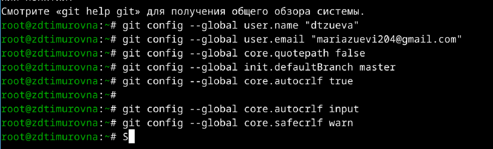{#fig:001 width=70%}
## 2. Создание ключа ssh
Создание ключей ssh возможно при помощи многих алгоритмов, например с алгоритмом rsa и размером 4096 
(современный стандарт безопасности) и с алгоритмом ed25519
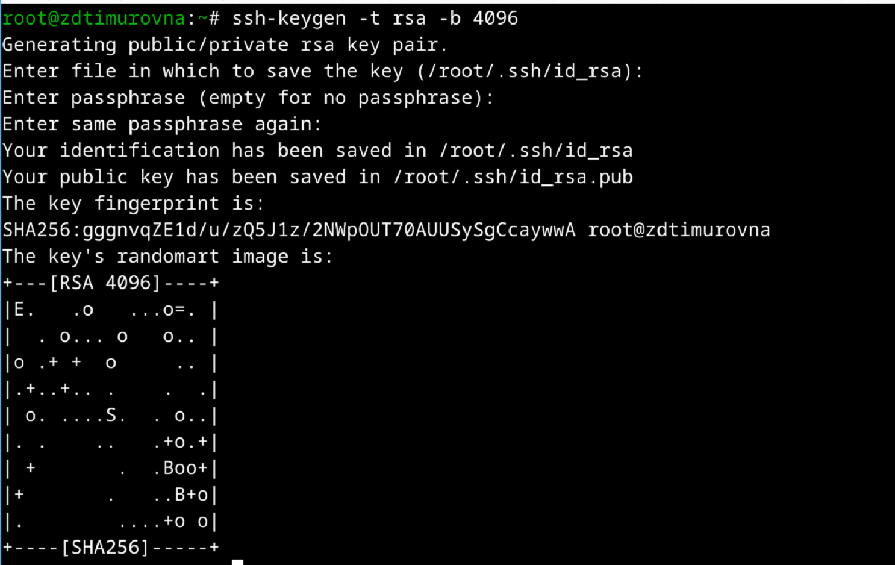{#fig:002 width=70%}

## 3. Добавление ssh ключа в Github
Для начала регистрирую новую учетную запись в github. Затем, после всего нужного ряда действий, добавляем ssh ключ в Github.
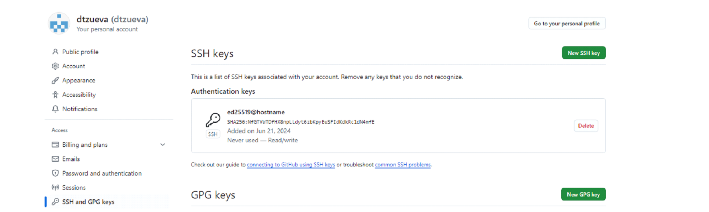{#fig:003 width=70%}

## 4. Создание GPG ключа
При создании ключа используется команда `gpg --full-generate-key`, после которой можно настроить автоматическую подпись коммитов git.
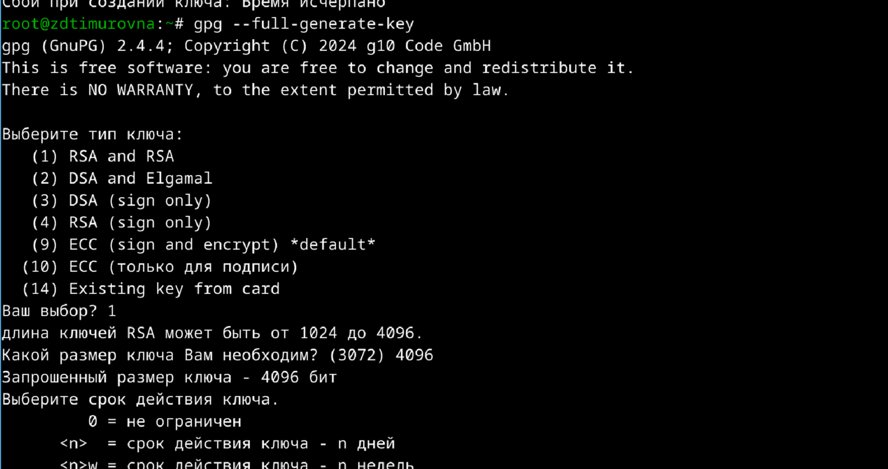{#fig:004 width=70%}
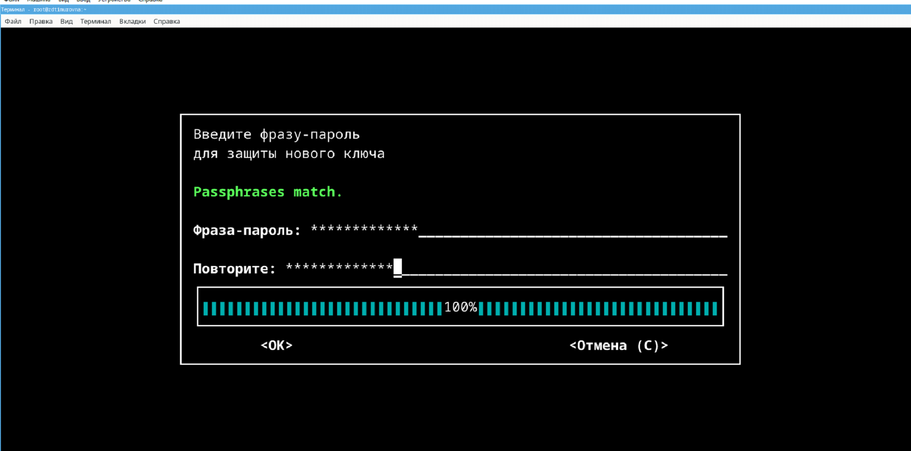{#fig:005 width=70%}
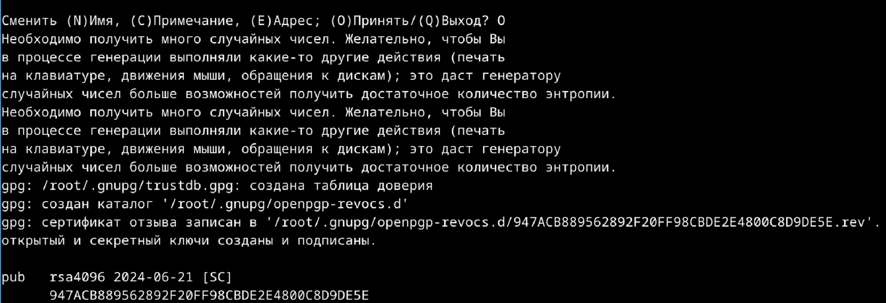{#fig:006 width=70%}

## 5. Добавление GPG ключа на Github 
Выведем список всех gpg ключей:
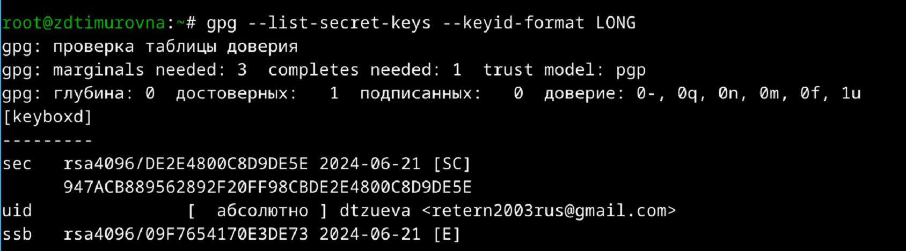{#fig:007 width=70%}
Добавим нужный ключ на Github аналогично ключу ssh.
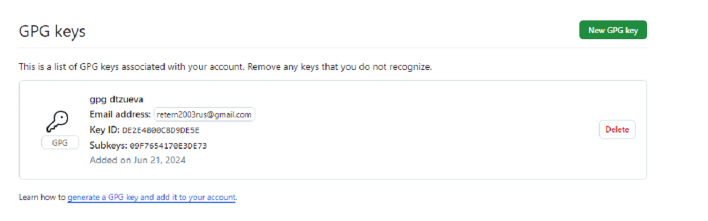{#fig:008 width=70%}

## 6. Настройка автоматических подписей коммитов git
Для настройки автоматических подписей коммитов надо выполнить следующий ряд комманд:
```shell
git config --global user.signingkey DE2E4800C8D9DE5E
git config --global commit.gpgsign true
git config --global gpg.program $(which gpg2)
```

## 7. Настройка gh
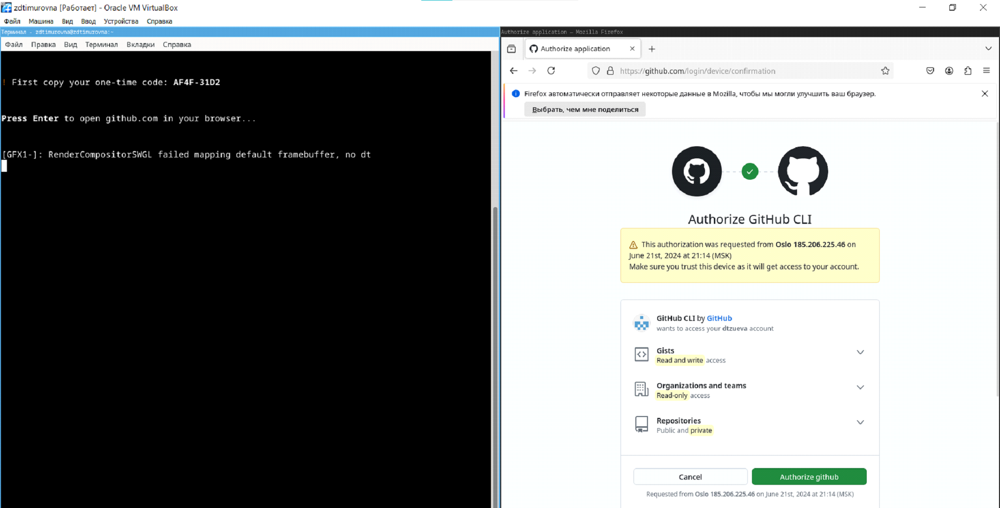{#fig:009 width=70%}
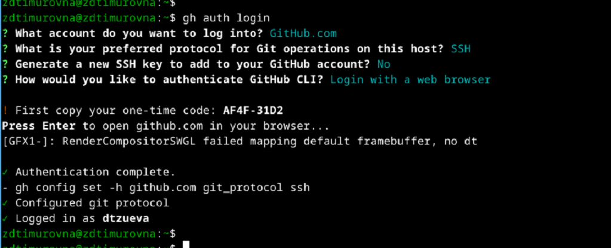{#fig:010 width=70%}

## 8. Создание репозитория курса на основе шаблона
Создадим новый репозиторий на основе шаблона.
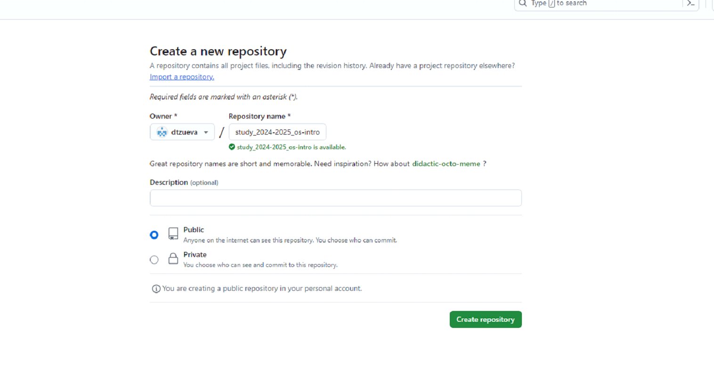{#fig:011 width=70%}
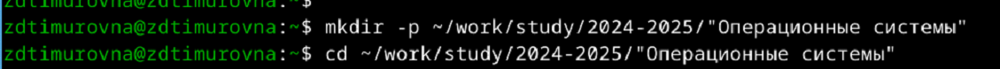{#fig:012 width=70%}
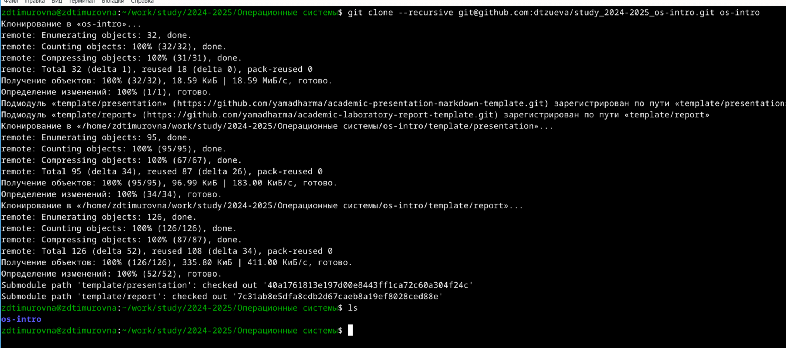{#fig:013 width=70%}

## 9. Настройка каталога курса
Настроим каталог курса по средствам удаления и модифицирования файлов.
{#fig:014 width=70%}
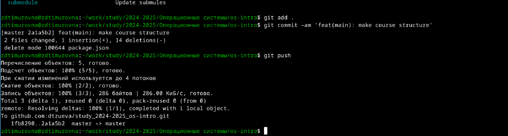{#fig:015 width=70%}
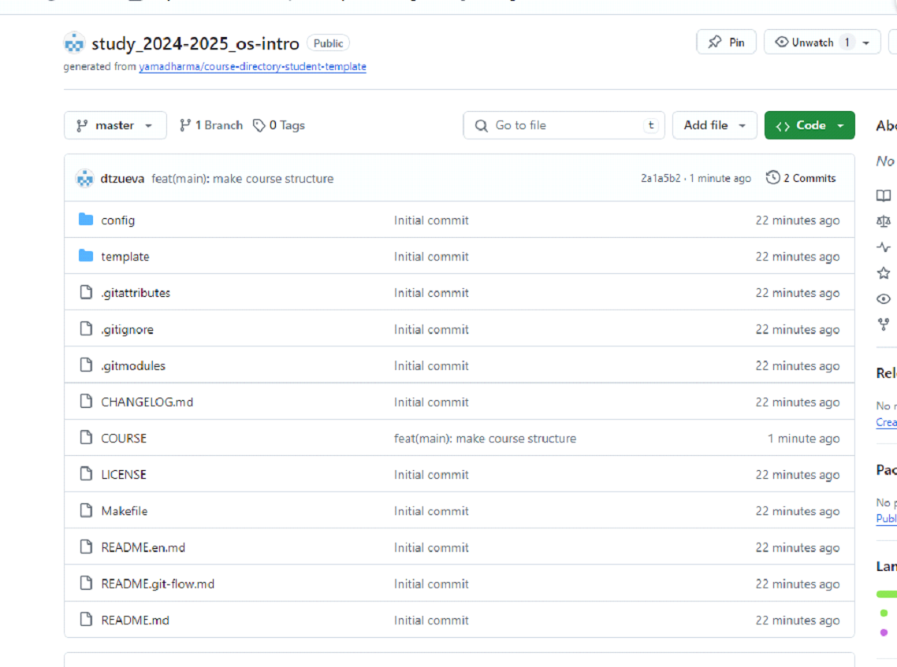{#fig:016 width=70%}

## 10. Контрольные вопросы
### 1. Что такое системы контроля версий (VCS) и для решения каких задач они предназначаются?

Системы контроля версий (VCS) — это инструменты, предназначенные для управления изменениями в файлах и коде в процессе разработки программного обеспечения. Они позволяют:
- **Отслеживать изменения**: сохранять историю изменений файлов.
- **Управлять версиями**: создавать и переключаться между различными версиями проекта.
- **Совместно работать**: поддерживать коллективную работу над проектом, синхронизировать изменения между участниками.
- **Восстанавливать состояние**: возвращаться к предыдущим состояниям файлов.
- **Создавать ветки**: параллельно работать над различными функциональными возможностями и багфиксами.

### 2. Объясните следующие понятия VCS и их отношения: хранилище, commit, история, рабочая копия.

- **Хранилище (repository)**: основное место, где хранятся все файлы проекта и их истории изменений. Хранилище может быть локальным (на компьютере пользователя) или удалённым (на сервере).
- **Commit**: фиксация изменений. Это операция, при которой сохраняются изменения в файлах и добавляется запись в историю изменений с описанием изменений и временем их внесения.
- **История (history)**: последовательность всех коммитов в хранилище, отражающая изменения проекта с течением времени.
- **Рабочая копия (working copy)**: текущее состояние файлов проекта на вашем компьютере. Рабочая копия может содержать изменения, которые ещё не зафиксированы в коммите.

### 3. Что представляют собой и чем отличаются централизованные и децентрализованные VCS? Приведите примеры VCS каждого вида.

**Централизованные VCS**:
- _Описание_: В централизованных VCS есть один центральный сервер, где хранится основное хранилище. Клиенты получают доступ к этому серверу для получения и внесения изменений.
- _Примеры_: Subversion (SVN), CVS.
- _Преимущества_: Простой и понятный рабочий процесс, контроль над доступом.
- _Недостатки_: Зависимость от центрального сервера, ограниченная поддержка работы офлайн.

**Децентрализованные VCS**:
- _Описание_: В децентрализованных VCS каждый разработчик имеет полную копию хранилища, включая всю историю изменений. Это позволяет работать независимо от центрального сервера.
- _Примеры_: Git, Mercurial.
- _Преимущества_: Возможность работы офлайн, распределённость, повышенная устойчивость к сбоям.
- _Недостатки_: Более сложное управление синхронизацией и объединением изменений.

### 4. Опишите действия с VCS при единоличной работе с хранилищем.

1. Создание нового хранилища:
```shell
git init
```
2. Добавление файлов в хранилище:
```shell
git add <файл>   # Добавить конкретный файл
git add .        # Добавить все файлы в текущем каталоге
```
3. Создание коммита:
```shell 
git commit -m "Сообщение коммита"
```
4. Просмотр истории изменений:
```shell
git log
```
5. Создание веток для новых функций или изменений:
```shell
git branch <имя_ветки>
git checkout <имя_ветки>
```

### 5. Опишите порядок работы с общим хранилищем VCS.

1. Клонирование удалённого хранилища:
```shell
git clone <URL>
```
2. Создание новой ветки для работы над задачей:
```shell
git checkout -b <имя_ветки>
```
3. Внесение изменений и создание коммитов:
```shell
git add <файл>
git commit -m "Описание изменений"
```
4. Обновление локальной копии перед отправкой изменений:
```shell
git fetch origin
git merge origin/main  		# Предполагая, что основная ветка называется  "main"
```
5. Отправка изменений в удалённое хранилище:
```shell
git push origin <имя_ветки>
```
6. Создание pull request для объединения изменений с основной веткой через интерфейс хостинга, например, GitHub или GitLab.

### 6. Каковы основные задачи, решаемые инструментальным средством git?

- **Отслеживание изменений в файлах**: фиксация изменений, создание коммитов.
- **Управление версиями**: создание и переключение между версиями проекта.
- **Работа с ветками**: создание, слияние, удаление веток для параллельной работы.
- **Синхронизация с удалёнными хранилищами**: клонирование, отправка и получение изменений.
- **Объединение изменений**: автоматическое и ручное слияние веток.
- **Разрешение конфликтов**: выявление и устранение конфликтов при слиянии изменений.

### 7. Назовите и дайте краткую характеристику командам git.

`git init`: Инициализация нового локального репозитория.  
`git clone <URL>`: Клонирование удалённого репозитория.  
`git add <файл>`: Добавление изменений в рабочей копии для следующего коммита.  
`git commit -m "сообщение"`: Создание нового коммита с описанием изменений.  
`git status`: Проверка состояния рабочей копии и индекса.  
`git log`: Просмотр истории коммитов.  
`git branch <имя_ветки>`: Создание новой ветки.  
`git checkout <имя_ветки>`: Переключение на другую ветку.  
`git merge <имя_ветки>`: Слияние указанной ветки с текущей.  
`git push`: Отправка изменений в удалённый репозиторий.  
`git pull`: Получение и объединение изменений из удалённого репозитория.  
`git fetch`: Получение изменений из удалённого репозитория без слияния.  

### 8. Приведите примеры использования при работе с локальным и удалённым репозиториями.

Локальный репозиторий:
```shell
git init
git add .
git commit -m "Initial commit"
```
Удалённый репозиторий:
```shell
git clone https://github.com/user/repo.git
cd repo
git checkout -b new-feature
git add .
git commit -m "Add new feature"
git push origin new-feature
```

### 9. Что такое и зачем могут быть нужны ветви (branches)?

Ветви (branches) — это параллельные версии хранилища, позволяющие работать над различными задачами независимо друг от друга. Ветви нужны для:
- **Изолирования разработки**: Разработка новых функций, исправление багов или эксперименты могут вестись независимо от основной ветки.
- **Упрощения слияния**: Легкое объединение изменений после завершения работы.
- **Обеспечения стабильности**: Основная ветка (например, main) остаётся стабильной и используется для выпуска релизов, а разработка ведётся в отдельных ветках.

### 10. Как и зачем можно игнорировать некоторые файлы при commit?

Иногда требуется игнорировать определённые файлы или каталоги, чтобы они не были добавлены в репозиторий. Это может быть полезно для:  
**Исключения временных файлов**: Логи, временные файлы, кэш.  
**Секретной информации**: Конфигурационные файлы с паролями или ключами.  
Для игнорирования файлов используется файл .gitignore. Пример содержимого .gitignore:
```gitignore
# Игнорировать все файлы .log
*.log

# Игнорировать директорию temp
temp/

# Игнорировать файл config.yaml
config.yaml
```

Добавление файлов в `.gitignore` гарантирует, что они не будут отслеживаться Git и не попадут в репозиторий.


# Вывод

В ходе лабораторной работы были изучены базовые навыки работы с git и его идеология, а также его настройка и на практическом примере создала репозиторий и выполнила коммит.