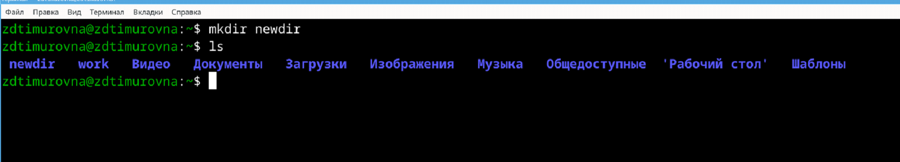

---
## Front matter
title: "Отчёт по лабораторной работе №4"
subtitle: "Дисциплина: Операционные Cистемы"
author: "Зуева Дарья Тимуровна, НПМбв-01-20"

## Generic otions
lang: ru-RU
toc-title: "Содержание"

## Bibliography
bibliography: bib/cite.bib
csl: pandoc/csl/gost-r-7-0-5-2008-numeric.csl

## Pdf output format
toc: true # Table of contents
toc-depth: 2
lof: true # List of figures
lot: true # List of tables
fontsize: 12pt
linestretch: 1.5
papersize: a4
documentclass: scrreprt
## I18n polyglossia
polyglossia-lang:
  name: russian
  options:
	- spelling=modern
	- babelshorthands=true
polyglossia-otherlangs:
  name: english
## I18n babel
babel-lang: russian
babel-otherlangs: english
## Fonts
mainfont: PT Serif
romanfont: PT Serif
sansfont: PT Sans
monofont: PT Mono
mainfontoptions: Ligatures=TeX
romanfontoptions: Ligatures=TeX
sansfontoptions: Ligatures=TeX,Scale=MatchLowercase
monofontoptions: Scale=MatchLowercase,Scale=0.9
## Biblatex
biblatex: true
biblio-style: "gost-numeric"
biblatexoptions:
  - parentracker=true
  - backend=biber
  - hyperref=auto
  - language=auto
  - autolang=other*
  - citestyle=gost-numeric
## Pandoc-crossref LaTeX customization
figureTitle: "Рис."
tableTitle: "Таблица"
listingTitle: "Листинг"
lofTitle: "Список иллюстраций"
lotTitle: "Список таблиц"
lolTitle: "Листинги"
## Misc options
indent: true
header-includes:
  - \usepackage{indentfirst}
  - \usepackage{float} # keep figures where there are in the text
  - \floatplacement{figure}{H} # keep figures where there are in the text
---

# Цель работы

Целью данной работы является приобретение практических навыков установки операционной системы на виртуальную машину, настройки минимально необходимых для дальнейшей работы сервисов.

# Задание

1. Определение полного имени домашнего каталога
2. Работа с каталогом `/tmp` и командой вывода `ls`
3. Создание и удаление каталогов
4. Определение опции команды `ls` для просмотра содержимого не только указанного каталога, 
но и подкаталогов, входящих в него.
5. Определение набора опций команды `ls`, позволяющего отсортировать по времени 
последнего изменения выводимый список содержимого каталога с развёрнутым описанием файлов.
6. Просмотр описания следующих команд: `cd`, `pwd`, `mkdir`, `rmdir`, `rm`. Основные опции этих команд.
7. Используя информацию, полученную при помощи команды `history`, выполнение модификаций и исполнения нескольких команд из буфера команд.
8. Контрольные вопросы

# Выполнение лабораторной работы

## 1. Определение полного имени домашнего каталога
Для определения полного имени домашнего каталога используется команда `pwd`
{#fig:001 width=70%}

## 2. Работа с каталогом `/tmp` и командой вывода `ls`
Для начала перейдем в каталог `/tmp`:
{#fig:001 width=70%}

Выведем содержимое каталога без опций при помощи `ls` и получим следующий вывод:
{#fig:001 width=70%}

После чего выполним `ls -a`, где опция `-a` позволяет увидеть скрытые файлы:
{#fig:001 width=70%}

Опция `-l` выводит содержимое каталога и подробную информацию о файлах. 
{#fig:001 width=70%}

При этом о каждом файле и каталоге выведена следующая информация: тип файла, право доступа, число ссылок, владелец, размер, дата последней ревизии, имя файла или каталога.  
Опция `-F` выводит содержимое каталога и информацию о типах файлов:
{#fig:001 width=70%}

И последний вариант `-alF`, который является суммой предыдущих команд. Выводит содержимое каталога, полную информацию о каждом файле, типы файлов и скрытые файлы.
{#fig:001 width=70%}

Определим есть ли в каталоге `/var/spool` подкаталог с именем `cron` при помощи команды `ls` и `grep`. 
Итоговая команда выглядит как `ls /var/spool/ | grep cron`:
{#fig:001 width=70%}

В итоге получается, что есть не только точное совпадения строки `cron`, но также и `anacron`, который отвечает за то, чтобы запланированные скрипты через `cron` работали даже после перезагрузки.  
Но для `cron` нужно постоянно включенная системы для безошибочной работы. 

Теперь выведем на экран содержимое домашнего каталога и определим кто является владельцем файлов и подкаталогов:
{#fig:001 width=70%}

## 3. Создание и удаление каталогов
В домашнем каталоге создадим новый каталог с именем `newdir` при помощи команды `mkdir newdir`:
{#fig:001 width=70%}

В каталоге `newdir` создадим новый каталог с именем `morefun`, используя команду `mkdir ~/newdir/morefun`:
{#fig:001 width=70%}

В домашнем каталоге одной командой создадим три новых каталога с именами `letters`, `memos`, `misk`. 
Затем удалим эти каталоги одной командой.  
Создание происходит при помощи команды `mkdir letters memos misk`:
{#fig:001 width=70%}

А теперь удалим все созданные только что директории:
{#fig:001 width=70%}

Попробуем удалить ранее созданный каталог `newdir` командой `rm`.  
Изначально команда `rm` предназначалась для удаления файлов, не директорий, и из-за этого каталоги удалить с помощью нее невозможно. 
Для удаления каталога нужно выполнить команду `rm -d`. Но это работает только если директория не пуста. 
Чтобы удалить не-пустую директорию, нужно добавить опцию `-r`:
{#fig:001 width=70%}

Попробуем удалить уже несуществующий каталог `newdir/morefun` из домашнего каталога.  
При попытке удаления несуществующего каталога получается только ошибка о несуществовании каталогов или файлов по указанному пути. 

## 4. Определение опции команды `ls` для просмотра содержимого не только указанного каталога, но и подкаталогов, входящих в него.
Информацию об команде `ls` можно получить при помощи команды `man ls` и найдем в нем опцию `recursive`, которая позволяет вывести содержимое подкаталогов
{#fig:001 width=70%}

## 5. Определение набора опций команды `ls`, позволяющего отсортировать по времени последнего изменения выводимый список содержимого каталога с развёрнутым описанием файлов.
Для выполнения это задания нужно использовать комбинацию из опции(флагов) для команды `ls`:
{#fig:001 width=70%}

## 6. Просмотр описания следующих команд: `cd`, `pwd`, `mkdir`, `rmdir`, `rm`. Основные опции этих команд.
Для команды `cd` основной опцией является перемещение в указанную директорию, которая передается в качестве аргумента
{#fig:001 width=70%}

Для `pwd` основная опция -- просмотр полного пути к папке, из которой пишется команда
{#fig:001 width=70%}

Для `mkdir` основная опция -- создание нового каталога
{#fig:001 width=70%}

Для `rmdir` основная опция -- удаление пустого каталога
{#fig:001 width=70%}

Для `rm` основная опция -- удаление файлов или пустого каталога. Для удаления каталога с файлами нужна опция `-r`
{#fig:001 width=70%}

## 7. Используя информацию, полученную при помощи команды `history`, выполнение модификаций и исполнения нескольких команд из буфера команд.
{#fig:001 width=70%}

{#fig:001 width=70%}

## 8. Контрольные вопросы

### 1. Что такое командная строка?
Командная строка (или терминал) — это интерфейс, который позволяет пользователям взаимодействовать с операционной системой путем ввода текстовых команд. В UNIX-подобных системах, таких как Linux и macOS, командная строка позволяет выполнять широкий спектр задач, от управления файлами до запуска программ и скриптов.

### 2. При помощи какой команды можно определить абсолютный путь текущего каталога? Приведите пример.
Для определения абсолютного пути текущего каталога используется команда `pwd`
{#fig:001 width=70%}

### 3. При помощи какой команды и каких опций можно определить только тип файлов и их имена в текущем каталоге? Приведите примеры.
Для определения типа файлов и их имен используется команда `ls` с опцией `-F`
{#fig:001 width=70%}

### 4. Каким образом отобразить информацию о скрытых файлах? Приведите примеры.
Для отображения скрытых файлов используется команда `ls` с опцией `-a` или `-A`
{#fig:001 width=70%}

Опция `-a` показывает все файлы, включая `.` и `..`, а `-A` исключает их.
### 5. При помощи каких команд можно удалить файл и каталог? Можно ли это сделать одной и той же командой? Приведите примеры.
Для удаления файла используется команда `rm`, а для удаления каталога — `rmdir` или `rm -r`. 
{#fig:001 width=70%}

Команда `rm` с опцией `-r` (рекурсивное удаление) может использоваться для удаления как файлов, так и каталогов.
### 6. Каким образом можно вывести информацию о последних выполненных пользователем командах? работы?
Для этого используется команда `history`
{#fig:001 width=70%}

### 7. Как воспользоваться историей команд для их модифицированного выполнения? Приведите примеры.
Для модифицированного выполнения команд из истории используется подстановка в истории команд
{#fig:001 width=70%}

### 8. Приведите примеры запуска нескольких команд в одной строке.
Для этого можно использовать символы `;`, `&&` или `||`.  
Примеры:  
```shell
cd /home; ls -l
cd /home && ls -l
cd /nonexistent || echo "Directory does not exist"
```
### 9. Дайте определение и приведите примера символов экранирования.
Экранирование используется для предотвращения интерпретации специальных символов. Примеры:
```shell
echo "Hello \$USER"              # Отображает "Hello $USER"
echo "File path is /home/user"   # Отображает "File path is /home/user"
```
### 10. Охарактеризуйте вывод информации на экран после выполнения команды ls с опцией l.
Опция `-l` выводит подробную информацию о файлах и каталогах
{#fig:001 width=70%}

Вывод включает:
- Права доступа
- Количество ссылок
- Владелец
- Группа
- Размер
- Дата и время последней модификации
- Имя файла или каталога

### 11. Что такое относительный путь к файлу? Приведите примеры использования относительного и абсолютного пути при выполнении какой-либо команды.
Относительный путь указывает путь к файлу или каталогу относительно текущего рабочего каталога. Пример:  
- Абсолютный путь: `/home/user/file1.txt`
- Относительный путь: `../user/file1.txt` (если текущий каталог — /home/other)

Использование:  
```shell
cp /home/user/file1.txt /home/user/backup/   # Абсолютный путь
cp ../user/file1.txt ./backup/               # Относительный путь
```

### 12. Как получить информацию об интересующей вас команде?
Для этого используется команда `man` или опция `--help`.

### 13. Какая клавиша или комбинация клавиш служит для автоматического дополнения вводимых команд?
Для автодополнения используется клавиша `Tab`.

# Выводы
В ходе этой лабораторной работы были приобретены практические навыки взаимодействия с системой посредством командной строки.

# Список литературы{.unnumbered}

::: {#refs}
:::

