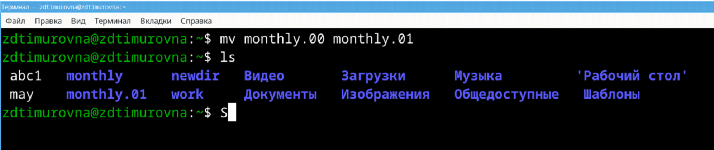
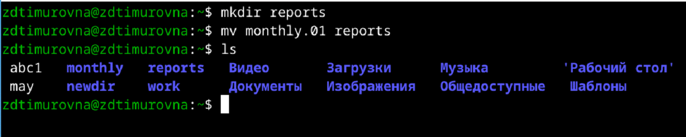
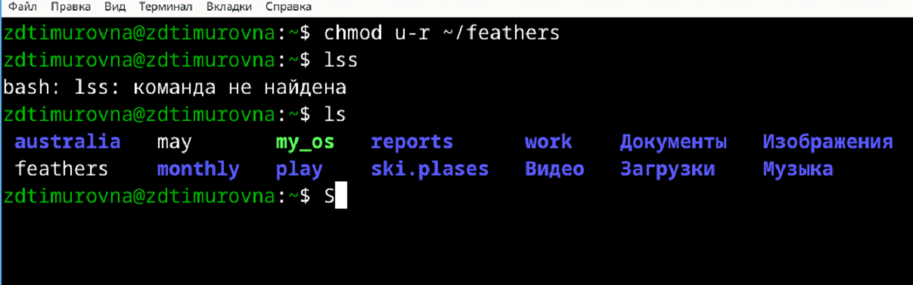
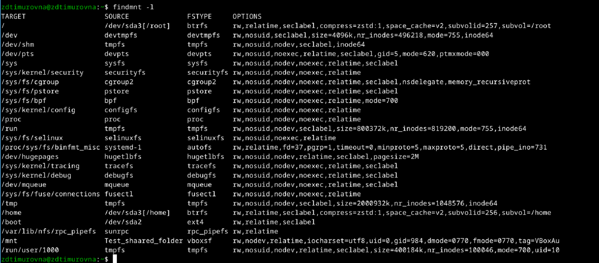

---
## Front matter
title: "Отчёт по лабораторной работе №5"
subtitle: "Дисциплина: Операционные Cистемы"
author: "Зуева Дарья Тимуровна, НПМбв-01-20"

## Generic otions
lang: ru-RU
toc-title: "Содержание"

## Bibliography
bibliography: bib/cite.bib
csl: pandoc/csl/gost-r-7-0-5-2008-numeric.csl

## Pdf output format
toc: true # Table of contents
toc-depth: 2
lof: true # List of figures
lot: true # List of tables
fontsize: 12pt
linestretch: 1.5
papersize: a4
documentclass: scrreprt
## I18n polyglossia
polyglossia-lang:
  name: russian
  options:
	- spelling=modern
	- babelshorthands=true
polyglossia-otherlangs:
  name: english
## I18n babel
babel-lang: russian
babel-otherlangs: english
## Fonts
mainfont: PT Serif
romanfont: PT Serif
sansfont: PT Sans
monofont: PT Mono
mainfontoptions: Ligatures=TeX
romanfontoptions: Ligatures=TeX
sansfontoptions: Ligatures=TeX,Scale=MatchLowercase
monofontoptions: Scale=MatchLowercase,Scale=0.9
## Biblatex
biblatex: true
biblio-style: "gost-numeric"
biblatexoptions:
  - parentracker=true
  - backend=biber
  - hyperref=auto
  - language=auto
  - autolang=other*
  - citestyle=gost-numeric
## Pandoc-crossref LaTeX customization
figureTitle: "Рис."
tableTitle: "Таблица"
listingTitle: "Листинг"
lofTitle: "Список иллюстраций"
lotTitle: "Список таблиц"
lolTitle: "Листинги"
## Misc options
indent: true
header-includes:
  - \usepackage{indentfirst}
  - \usepackage{float} # keep figures where there are in the text
  - \floatplacement{figure}{H} # keep figures where there are in the text
---

# Цель работы

Цель работы – ознакомление с файловой системой Linux, её структурой, именами и содержанием каталогов. Приобретение практических навыков по применению команд для работы с файлами и каталогами, по управлению процессами (и работами), по проверке использования диска и обслуживанию файловой системы.


# Задание

1. Все примеры, приведённые в первой части описания лабораторной работы
2. Копирование, переименование, перемещение файла и работа с каталогами
3. Определение опций команды chmod, необходимых для того, чтобы присвоить определенным файлам выделенные права доступа, 
считая, что в начале таких прав нет
4. Просмотр содержимого файла, копирование и перемещение файлов и каталогов, работа с правами на чтение и выполнение файла
5. Команда man по командам `mount`, `fsck`, `mkfs`, `kill` и кратко их охарактеризуйте, приведя примеры
6. Контрольные вопросы 

# Выполнение лабораторной работы
## 1. Все выполненные примеры, приведённые в первой части описания лабораторной работы
{#fig:001 width=70%}
{#fig:001 width=70%}
{#fig:001 width=70%}
{#fig:001 width=70%}
{#fig:001 width=70%}

{#fig:001 width=70%}
{#fig:001 width=70%}
{#fig:001 width=70%}
{#fig:001 width=70%}
{#fig:001 width=70%}

{#fig:001 width=70%}
{#fig:001 width=70%}
{#fig:001 width=70%}
{#fig:001 width=70%}

{#fig:001 width=70%}
{#fig:001 width=70%}
{#fig:001 width=70%}
{#fig:001 width=70%}

## 2. Копирование, переименование, перемещение файла и работа с каталогами
Скопируем файл `/usr/include/sys/io.h` в домашний каталог и назовем его `equipment` 
Для это выполним:
```shell
cp /usr/include/sys/io.h ~/equipment
```
{#fig:001 width=70%}

В домашнем каталоге создадим директорию `ski.plases`:
{#fig:001 width=70%}

Переместим скопированный файл `equipment` в созданный каталог:
{#fig:001 width=70%}

Переименуем файл `ski.plases/equipment` в `ski.plases/equiplist`:
{#fig:001 width=70%}

Надо создать в домашнем каталоге файл `abc1` и скопировать его в каталог `ski.plases`, назовя его `equiplist2`.
Из-за того, что файл `abc1` уже был создан при выполнении примеров (см. выше), в выполнении пропущена команда его создания `touch abc1`:
{#fig:001 width=70%}

Создадим каталог с именем `equipment` в каталоге `ski.plases`:
{#fig:001 width=70%}

Переместим файлы `ski.plases/equiplist` и `equiplist2` в каталог `ski.plases/equipment`:
{#fig:001 width=70%}

Создадим и переместим каталог `newdir` в каталог `ski.plases` и назовем его `plans`:
{#fig:001 width=70%}

## 3. Определение опций команды chmod, необходимых для того, чтобы присвоить определенным файлам выделенные права доступа, считая, что в начале таких прав нет
Директории и файлы, и их права, которые нужно поставить:

- `drwxr–r–…` australia
{#fig:001 width=70%}

- `drwx–x–x…` play
{#fig:001 width=70%}

- `-r-xr–r–…` my_os
{#fig:001 width=70%}

- `-rw-rw-r–…` feathers
{#fig:001 width=70%}

## 4. Просмотр содержимого файла, копирование и перемещение файлов и каталогов, работа с правами на чтение и выполнение файла
Просмотрим содержимое файла `/etc/password`:
Выполним команду 
```shell
sudo cat /etc/password
``` 
Такого каталога не существует, но есть директория `/etc/passwd`
{#fig:001 width=70%}

Скопируем файл `feathers` в файл `file.old`:
{#fig:001 width=70%}

Переместим файл `file.old` в каталог `play`:
{#fig:001 width=70%}

Скопируем каталог `play` в каталог `fun`:
{#fig:001 width=70%}

Переместим каталог `fun` в каталог `play` и назовем его `games`:
{#fig:001 width=70%}

Лишим владельца файла `feathers` права на чтение:
{#fig:001 width=70%}

Попытаемся просмотреть файл `feathers` командой `cat`. Получаем ошибку.
{#fig:001 width=70%}

Попытаемся скопировать файл `feathers`. Получаем ошибку, так как у нас отсутствуют права на содержимое файла:
{#fig:001 width=70%}

Дадим владельцу файла `feathers` право на чтение:
{#fig:001 width=70%}

Лишим владельца каталога `play` права на выполнение:
{#fig:001 width=70%}

Попробуем перейти в каталог `play`. Получаем ошибку:
{#fig:001 width=70%}

Дадим владельцу каталога `play` обратно права на выполнение:
{#fig:001 width=70%}

## 5. Команда man по командам `mount`, `fsck`, `mkfs`, `kill` и кратко их охарактеризуйте, приведя примеры
Для того чтобы узнать характеристики команд используем `man`:
{#fig:001 width=70%}

Команда `mount` используется для монтирования файловых систем, т.е. для подключения файловой системы к определенному месту (точке монтирования) в файловой иерархии.   
_Пример_: `mount /dev/sdb1 /mnt`. Этот пример монтирует файловую систему, расположенную на разделе `/dev/sdb1`, в каталог `/mnt`.

Команда `fsck` (file system consistency check) используется для проверки целостности файловой системы и исправления ошибок.  
_Пример_: «`fsck /dev/sdb1`. Этот пример проверяет файловую систему на разделе `/dev/sdb1` и исправляет обнаруженные ошибки.

Команда `mkfs` (make filesystem) используется для создания новой файловой системы на указанном разделе или устройстве.  
_Пример_: `mkfs.ext4 /dev/sdb1`. Этот пример создает файловую систему ext4 на разделе `/dev/sdb1`.

Команда `kill` используется для отправки сигналов процессам. Обычно используется для завершения процесса.  
_Пример_: `kill 1234`. Этот пример отправляет сигнал завершения процессу с PID 1234. По умолчанию это сигнал SIGTERM (15).

## 6. Контрольные вопросы 
### 1. Дайте характеристику каждой файловой системе, существующей на жёстком диске компьютера, на котором вы выполняли лабораторную работу.
{#fig:001 width=70%}

- `Btrfs` — это современная файловая система с поддержкой сжатия данных, снимков и других передовых функций.
- `devtmpfs` (device tmpfs) — это файловая система в ядрах Linux, предназначенная для управления устройствами во время загрузки операционной системы.
- `tmpfs` — это файловая система в операционных системах Unix/Linux, которая хранит файлы в оперативной памяти (RAM).
- `devpts` (device pseudo-terminal filesystem) — это файловая система в операционных системах Unix/Linux, которая предназначена для управления псевдотерминалами (PTY - pseudo-terminal devices)
- `sysfs` — это виртуальная файловая система, предоставляемая ядром Linux для представления информации о системе и управления параметрами устройств.
- `securityfs` — это виртуальная файловая система в ядре Linux, предназначенная для предоставления интерфейса и управления модулями безопасности (Security Modules).
- `cgroup2` (Control Group v2) — это механизм в ядре Linux для управления ресурсами и изоляции процессов, предназначенный для ограничения и мониторинга ресурсов, используемых группами процессов (control groups или cgroups).
- `pstore` (persistent storage) — это механизм в ядре Linux, предназначенный для сохранения отладочной информации и сообщений об ошибках, которые могут происходить во время работы системы.
- `bpf` (Berkeley Packet Filter) - это механизм в ядре Linux, который обеспечивает возможность выполнения программного кода внутри ядра для обработки и фильтрации сетевых пакетов, а также для решения других задач, связанных с мониторингом и управлением сетевыми ресурсами.
- `configfs` — это виртуальная файловая система в ядре Linux, предназначенная для динамического создания и управления конфигурационными объектами (configuration objects).
- Файловая система `proc` (procfs) в операционных системах Unix и Linux представляет собой виртуальную файловую систему, которая обеспечивает доступ к информации о текущем состоянии системы и процессов, настройках ядра и других системных параметрах через файловый интерфейс.
- `selinuxfs` (Security-Enhanced Linux filesystem) — это виртуальная файловая система, используемая в Security-Enhanced Linux (SELinux), чтобы предоставлять интерфейс для управления и настройки политик безопасности SELinux.
- `autofs` (Automounter File System) — это утилита и файловая система в Unix-подобных операционных системах, таких как Linux, которая автоматически монтирует файловые системы по требованию.
- `hugetlbfs` (Huge Pages File System) — это виртуальная файловая система в ядре Linux, предназначенная для управления и использования "огромных страниц" (huge pages) в оперативной памяти системы.
- `tracefs` — это виртуальная файловая система в ядре Linux, предназначенная для предоставления доступа к различным отладочным и трассировочным возможностям ядра, таким как ftrace и другим инструментам для анализа и отладки работы ядра и пользовательских приложений.
- `debugfs` — это виртуальная файловая система в ядре Linux, предназначенная для предоставления доступа к различным отладочным возможностям ядра и устройств, а также для проведения диагностики и настройки системы в реальном времени.
- `mqueue` — это часть POSIX стандарта, который обеспечивает механизм передачи сообщений между процессами в Unix-подобных операционных системах.
- `fusectl` — это виртуальная файловая система (virtual filesystem) в ядре Linux, предназначенная для управления и мониторинга файловых систем, работающих на базе FUSE.
- `Ext4` (Fourth Extended Filesystem) — это одна из наиболее распространенных и устойчивых журналируемых файловых систем в Linux.
- `rpc_pipefs` (RPC Pipe File System) — это виртуальная файловая система в ядре Linux, которая предоставляет интерфейс для взаимодействия и передачи данных между клиентами и серверами, использующими удаленные процедурные вызовы.
- `vboxsf` (VirtualBox Shared Folders) — это файловая система, используемая в виртуальных машинах, созданных с помощью программного обеспечения Oracle VirtualBox.


### 2. Приведите общую структуру файловой системы и дайте характеристику каждой директории первого уровня этой структуры.
`/` — root каталог. Содержит в себе всю иерархию системы;  
`/bin` — здесь находятся двоичные исполняемые файлы. Основные общие команды, хранящиеся отдельно от других программ в системе (прим.: pwd, ls, cat, ps);  
`/boot` — тут расположены файлы, используемые для загрузки системы (образ initrd, ядро vmlinuz);  
`/dev` — в данной директории располагаются файлы устройств (драйверов). С помощью этих файлов можно взаимодействовать с устройствами. К примеру, если это жесткий диск, можно подключить его к файловой системе. В файл принтера же можно написать напрямую и отправить задание на печать;  
`/etc` — в этой директории находятся файлы конфигураций программ. Эти файлы позволяют настраивать системы, сервисы, скрипты системных демонов;  
`/home` — каталог, аналогичный каталогу Users в Windows. Содержит домашние каталоги учетных записей пользователей (кроме root). При создании нового пользователя здесь создается одноименный каталог с аналогичным именем и хранит личные файлы этого пользователя;  
`/lib` — содержит системные библиотеки, с которыми работают программы и модули ядра;  
`/lost+found` — содержит файлы, восстановленные после сбоя работы системы. Система проведет проверку после сбоя и найденные файлы можно будет посмотреть в данном каталоге;  
`/media` — точка монтирования внешних носителей. Например, когда вы вставляете диск в дисковод, он будет автоматически смонтирован в директорию /media/cdrom;  
`/mnt` — точка временного монтирования. Файловые системы подключаемых устройств обычно монтируются в этот каталог для временного использования;  
`/opt` — тут расположены дополнительные (необязательные) приложения. Такие программы обычно не подчиняются принятой иерархии и хранят свои файлы в одном подкаталоге (бинарные, библиотеки, конфигурации);  
`/proc` — содержит файлы, хранящие информацию о запущенных процессах и о состоянии ядра ОС;  
`/root` — директория, которая содержит файлы и личные настройки суперпользователя;  
`/run` — содержит файлы состояния приложений. Например, PID-файлы или UNIX-сокеты;  
`/sbin` — аналогично /bin содержит бинарные файлы. Утилиты нужны для настройки и администрирования системы суперпользователем;  
`/srv` — содержит файлы сервисов, предоставляемых сервером (прим. FTP или Apache HTTP);  
`/sys` — содержит данные непосредственно о системе. Тут можно узнать информацию о ядре, драйверах и устройствах;  
`/tmp` — содержит временные файлы. Данные файлы доступны всем пользователям на чтение и запись. Стоит отметить, что данный каталог очищается при перезагрузке;  
`/usr` — содержит пользовательские приложения и утилиты второго уровня, используемые пользователями, а не системой. Содержимое доступно только для чтения (кроме root). Каталог имеет вторичную иерархию и похож на корневой;  
`/var` — содержит переменные файлы. Имеет подкаталоги, отвечающие за отдельные переменные. Например, логи будут храниться в /var/log, кэш в /var/cache, очереди заданий в /var/spool/ и так далее.

### 3. Какая операция должна быть выполнена, чтобы содержимое некоторой файловой системы было доступно операционной системе?
Монтирование тома диска, то есть команда `mount`.

### 4. Назовите основные причины нарушения целостности файловой системы. Как устранить повреждения файловой системы?
Отсутствие синхронизации между образом файловой системы в памяти и ее данными на диске в случае аварийного останова может привести к появлению следующих ошибок:
1. Один блок адресуется несколькими mode (принадлежит нескольким файлам).
2. Блок помечен как свободный, но в то же время занят (на него ссылается `inode`).
3. Блок помечен как занятый, но в то же время свободен (ни один `inode` на него не ссылается).
4. Неправильное число ссылок в `inode` (недостаток или избыток ссылающихся записей в каталогах).
5. Несовпадение между размером файла и суммарным размером адресуемых `inode` блоков.
6. Недопустимые адресуемые блоки (например, расположенные за пределами файловой системы).
7. "Потерянные" файлы (правильные `inode`, на которые не ссылаются записи каталогов).
8. Недопустимые или неразмещенные номера `inode` в записях каталогов.

### 5. Как создаётся файловая система?
Файловая система создаётся путём форматирования раздела или устройства с помощью специальной 
команды, например, `mkfs` в Linux, что приводит к установке необходимых структур данных для 
организации и хранения файлов и каталогов.

### 6. Дайте характеристику командам для просмотра текстовых файлов.
Команды для просмотра текстовых файлов в операционных Unix-подобных системах предоставляют различные способы просмотра содержимого файлов:
- Команда `cat` используется для вывода содержимого одного или нескольких файлов на экран. Она также может использоваться для объединения файлов или создания новых файлов.
- `less` является просмотрщиком текстовых файлов с возможностью прокрутки вперед и назад, постраничным просмотром и поиском. Она поддерживает большие файлы и обеспечивает более удобный интерфейс для навигации по содержимому.
- `more` — это предшественник `less`, который также позволяет постраничный просмотр текстовых файлов, но с более ограниченными возможностями по сравнению с less.
- Команда `head` выводит первые несколько строк указанного файла. По умолчанию выводятся первые 10 строк, но это можно изменить с помощью опций команды.
- `tail` выводит последние несколько строк указанного файла. По умолчанию выводятся последние 10 строк, но также есть возможность изменить количество выводимых строк с помощью опций.

### 7. Приведите основные возможности команды cp в Linux.
`cp` это сокращение от `copy`, и она делает именно то, что предполагает ее название: копирует.  
`cp` используется для копирования файлов из одного местоположения в другое. Также ее можно использовать для копирования 
всех каталогов в новое место. Можно использовать эту команду для копирования нескольких файлов и каталогов.

### 8. Приведите основные возможности команды mv в Linux.
Команда `mv` используется для перемещения файлов из одного каталога в другой. 
Также команда `mv` используется для переименования файла в системах Linux.

### 9. Что такое права доступа? Как они могут быть изменены?
Права доступа определяют, какие действия конкретный пользователь может или не может совершать с определенным файлами и каталогами. Каждый файл можно изменять по трём параметра доступа.  

**Чтение** - разрешает получать содержимое файла, но на запись нет. Для каталога позволяет получить список файлов и каталогов, расположенных в нем;  
**Запись** - разрешает записывать новые данные в файл или изменять существующие, а также позволяет создавать и изменять файлы и каталоги;  
**Выполнение** - вы не можете выполнить программу, если у нее нет флага выполнения. Этот атрибут устанавливается для всех программ и скриптов, именно с помощью него система может понять, что этот файл нужно запускать как программу.  

Чтобы получить доступ к файлам в Linux, используются разрешения. Эти разрешения назначаются трем объектам: файлу, группе и другому объекту (то есть всем остальным). 
Изменить права доступа можно при помощи команды `chmod`:
```shell
chmod <параметры изменения> <имя_файла/каталога>
```


# Выводы

В ходе выполнения этой лабораторной произошло знакомство с файловой системой Linux, 
её структурой, именами и содержанием каталогов.  
Были приобретены практические навыки по применению команд для работы с файлами и 
каталогами, по управлению процессами (и работами), по проверке использования диска и 
обслуживанию файловой системы.

# Список литературы{.unnumbered}

::: {#refs}
:::
