---
## Front matter
title: "Отчёт по лабораторной работе №6"
subtitle: "Дисциплина: Операционные Cистемы"
author: "Зуева Дарья Тимуровна, НПМбв-01-20"

## Generic otions
lang: ru-RU
toc-title: "Содержание"

## Bibliography
bibliography: bib/cite.bib
csl: pandoc/csl/gost-r-7-0-5-2008-numeric.csl

## Pdf output format
toc: true # Table of contents
toc-depth: 2
lof: true # List of figures
lot: true # List of tables
fontsize: 12pt
linestretch: 1.5
papersize: a4
documentclass: scrreprt
## I18n polyglossia
polyglossia-lang:
  name: russian
  options:
	- spelling=modern
	- babelshorthands=true
polyglossia-otherlangs:
  name: english
## I18n babel
babel-lang: russian
babel-otherlangs: english
## Fonts
mainfont: PT Serif
romanfont: PT Serif
sansfont: PT Sans
monofont: PT Mono
mainfontoptions: Ligatures=TeX
romanfontoptions: Ligatures=TeX
sansfontoptions: Ligatures=TeX,Scale=MatchLowercase
monofontoptions: Scale=MatchLowercase,Scale=0.9
## Biblatex
biblatex: true
biblio-style: "gost-numeric"
biblatexoptions:
  - parentracker=true
  - backend=biber
  - hyperref=auto
  - language=auto
  - autolang=other*
  - citestyle=gost-numeric
## Pandoc-crossref LaTeX customization
figureTitle: "Рис."
tableTitle: "Таблица"
listingTitle: "Листинг"
lofTitle: "Список иллюстраций"
lotTitle: "Список таблиц"
lolTitle: "Листинги"
## Misc options
indent: true
header-includes:
  - \usepackage{indentfirst}
  - \usepackage{float} # keep figures where there are in the text
  - \floatplacement{figure}{H} # keep figures where there are in the text
---

# Цель работы
Цель работы – ознакомление с инструментами поиска файлов и фильтрации текстовых данных. Приобретение практических навыков: 
по управлению процессами (и заданиями), по проверке использования диска и обслуживанию файловых систем.

# Задание
1. Записать в файл `file.txt` названия файлов, содержащихся в каталоге `/etc`. Дописать в этот же файл названия файлов, содержащихся в домашнем каталоге
2. Вывести имена всех файлов из `file.txt`, имеющих расширение `.conf`, после чего записать их в новый текстовой файл `conf.txt`
3. Определить, какие файлы в домашнем каталоге имеют имена, начинавшиеся с символа `c`? Предложить несколько вариантов, как это сделать
4. Вывести на экран имена файлов из каталога `/etc`, начинающиеся с символа `h`
5. Запустить в фоновом режиме процесс, который будет записывать в файл `logfile` файлы, имена которых начинаются с `log`
6. Удалить файл `logfile`
7. Запустить из консоли в фоновом режиме редактор `gedit`. Определить идентификатор процесса `gedit`, используя команду `ps`, конвейер и фильтр `grep`
8. Прочесть справку команды `kill`, после чего использовать её для завершения процесса `gedit`
9. Выполнить команды `df` и `du`, предварительно получив более подробную информацию об этих командах, с помощью команды `man`
10. Воспользовавшись справкой команды `find`, вывести имена всех директорий, имеющихся в домашнем каталоге
11. Контрольные вопросы

# Выполнение лабораторной работы
## 1. Записать в файл `file.txt` названия файлов, содержащихся в каталоге `/etc`. Дописать в этот же файл названия файлов, содержащихся в домашнем каталоге
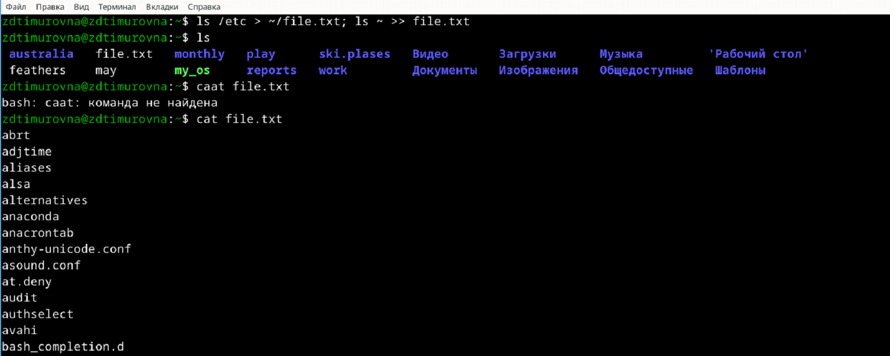{#fig:001 width=70%}

## 2. Вывести имена всех файлов из `file.txt`, имеющих расширение `.conf`, после чего записать их в новый текстовой файл `conf.txt`
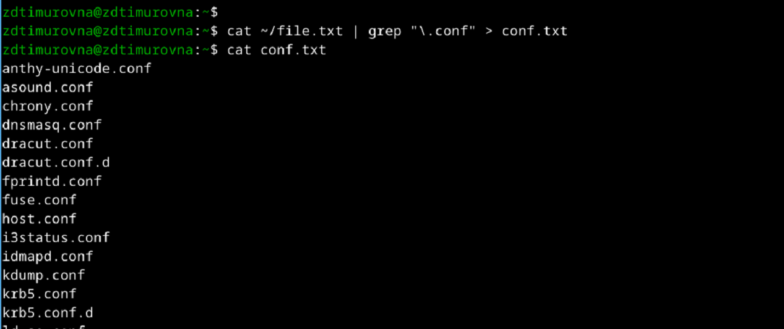{#fig:001 width=70%}

## 3. Определить, какие файлы в домашнем каталоге имеют имена, начинавшиеся с символа `c`? Предложить несколько вариантов, как это сделать
Вариант 1) Использовать `ls` и `grep`:
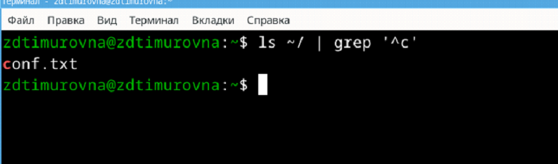{#fig:001 width=70%}

Вариант 2) Использование `find`:
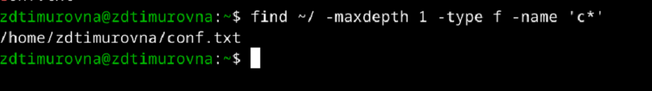{#fig:001 width=70%}

Вариант 3) Использование `ls` с подстановкой:
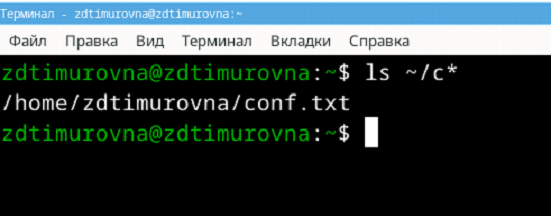{#fig:001 width=70%}

## 4. Вывести на экран имена файлов из каталога `/etc`, начинающиеся с символа `h`
```shell
ls /etc | grep "^h" | less
```
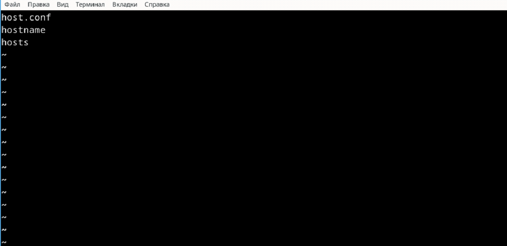{#fig:001 width=70%}

## 5. Запустить в фоновом режиме процесс, который будет записывать в файл `logfile` файлы, имена которых начинаются с `log`
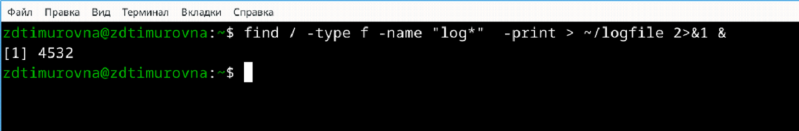{#fig:001 width=70%}

## 6. Удалить файл `logfile`
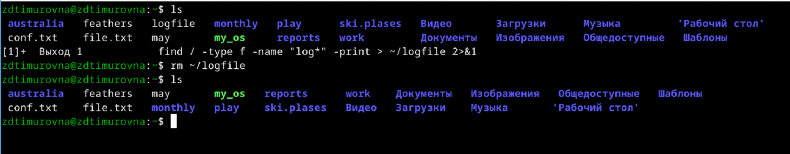{#fig:001 width=70%}

## 7. Запустить из консоли в фоновом режиме редактор `gedit`. Определить идентификатор процесса `gedit`, используя команду `ps`, конвейер и фильтр `grep`
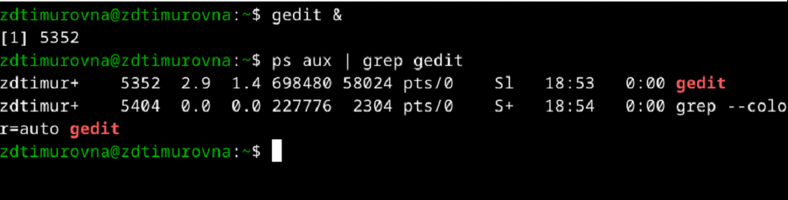{#fig:001 width=70%}

Также можно выполнить `pgrep gedit`, чтобы найти PID по названию задачи. 
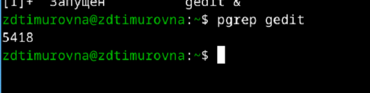{#fig:001 width=70%}

## 8. Прочесть справку команды `kill`, после чего использовать её для завершения процесса `gedit`
Для прочтения man-файла выполним команду `man kill`. А для завершения процесса при помощи `kill` нужно найти PID процесса, после чего выполнить `kill <PID>`
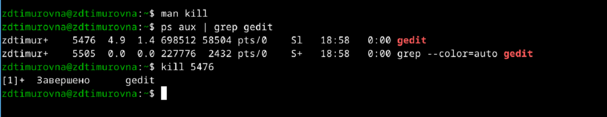{#fig:001 width=70%}

## 9. Выполнить команды `df` и `du`, предварительно получив более подробную информацию об этих командах, с помощью команды `man`
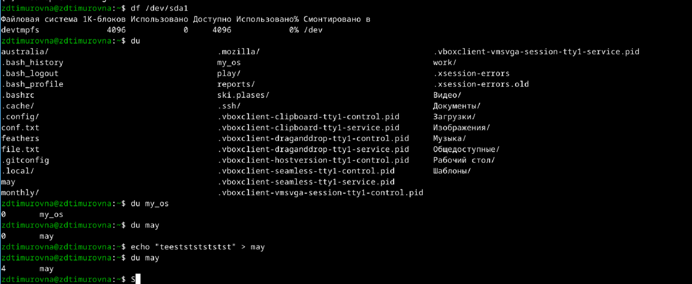{#fig:001 width=70%}

## 10. Воспользовавшись справкой команды `find`, вывести имена всех директорий, имеющихся в домашнем каталоге
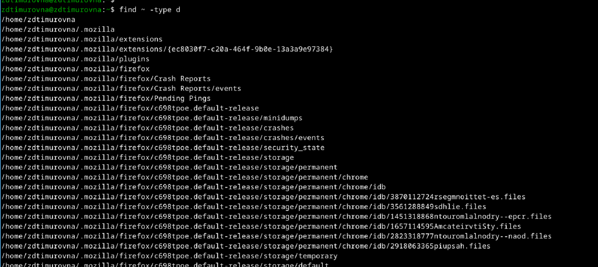{#fig:001 width=70%}

## 11. Контрольные вопросы
### 1. Какие потоки ввода вывода вы знаете?
- `stdin` — стандартный поток ввода (по умолчанию: клавиатура), файловый дескриптор 0  
- `stdout` — стандартный поток вывода (по умолчанию: консоль), файловый дескриптор 1
- `stderr` — стандартный поток вывода сообщений об ошибках (по умолчанию: консоль), файловый дескриптор 2
### 2. Объясните разницу между операцией > и >>.
`>filename` - Перенаправление вывода (stdout) в файл `filename`  
`>>filename` - Перенаправление вывода (stdout) в файл `filename`, файл открывается в режиме добавления
### 3. Что такое конвейер?
Конвейер (`pipe`) служит для объединения простых команд или утилит в цепочки, в которых результат работы предыдущей команды передаётся последующей.   
Синтаксис следующий: 
```shell
<команда 1> | <команда 2>
```
### 4. Что такое процесс? Чем это понятие отличается от программы?
Компьютерная программа сама по себе — лишь пассивная последовательность инструкций. 
В то время как процесс — непосредственное выполнение этих инструкций.
### 5. Что такое PID и GID?
Идентификатор процесса (`PID`). Каждому новому процессу ядро присваивает уникальный идентификационный номер. В любой момент времени идентификатор процесса является уникальным, хотя после завершения процесса он может использоваться снова для другого процесса. Некоторые идентификаторы зарезервированы системой для особых процессов. Так, процесс с идентификатором 1 — это процесс инициализации `init`, являющийся предком всех других процессов в системе.  
Идентификатор группы `GID` и эффективный идентификатор группы (`EGID`) `GID` — это идентификационный номер группы данного процесса. 
`EGID` связан с `GID` также, как `EUID` с `UID`.
### 6. Что такое задачи и какая команда позволяет ими управлять?
Задачи — это то, что мы подаем на выполнение системе, какой-то процесс, который она начинает выполнять.  
Команда `jobs` позволяет ими управлять.
### 7. Найдите информацию об утилитах top и htop. Каковы их функции?
`top` (table of processes) — консольная команда, которая выводит список работающих в системе процессов и информацию о них. По умолчанию она в реальном времени сортирует их по нагрузке на процессор. Программа написана для UNIX-совместимых операционных систем и опубликована под свободной лицензией GNU FDL.  
`htop` — продвинутый монитор процессов, написанный для Linux. Он был задуман заменить стандартную программу `top`. `Htop` показывает динамический список системных процессов, список обычно выравнивается по использованию ЦПУ. В отличие от `top`, `htop` показывает все процессы в системе. Также показывает время непрерывной работы, использование процессоров и памяти. `Htop` часто применяется в тех случаях, когда информации даваемой утилитой `top` недостаточно, например при поиске утечек памяти в процессах.
### 8. Назовите и дайте характеристику команде поиска файлов. Приведите примеры использования этой команды.
Команда `find` используется для поиска и отображения на экран имён файлов, соответствующих заданной строке символов.  
Формат команды: `find <путь> <-опции>`  
_Пример_:
```shell
find /etc -name "p*" -print
```
### 9. Можно ли по контексту (содержанию) найти файл? Если да, то как?
Для поиска файла по содержимому проще всего воспользоваться командой `grep` (вместо `find`). 
_Пример_:
```shell
grep -r строка_поиска каталог
```
### 10. Как определить объем свободной памяти на жёстком диске?
При помощи команды `df` (аббревиатура от disk free) — утилита в UNIX и UNIX-подобных системах, показывает 
список всех файловых систем по именам устройств, сообщает их размер, занятое и свободное пространство и точки монтирования.
### 11. Как определить объем вашего домашнего каталога?
```shell
du -a ~
```
### 12. Как удалить зависший процесс?
```shell
kill -9 <PID>
```

# Выводы

В ходе данной лабораторной работы я ознакомилась с инструментами поиска файлов и фильтрации текстовых данных и 
приобрела практические навыки по управлению процессами, по проверке использования диска и обслуживанию файловых систем.

# Список литературы{.unnumbered}

::: {#refs}
:::
