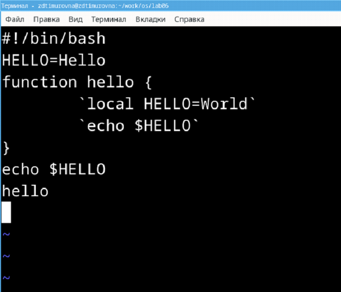

---
## Front matter
title: "Отчёт по лабораторной работе №8"
subtitle: "Дисциплина: Операционные Cистемы"
author: "Зуева Дарья Тимуровна, НПМбв-01-20"

## Generic otions
lang: ru-RU
toc-title: "Содержание"

## Bibliography
#bibliography: bib/cite.bib
#csl: pandoc/csl/gost-r-7-0-5-2008-numeric.csl

## Pdf output format
toc: true # Table of contents
toc-depth: 2
lof: true # List of figures
lot: true # List of tables
fontsize: 12pt
linestretch: 1.5
papersize: a4
documentclass: scrreprt
## I18n polyglossia
polyglossia-lang:
  name: russian
  options:
	- spelling=modern
	- babelshorthands=true
polyglossia-otherlangs:
  name: english
## I18n babel
babel-lang: russian
babel-otherlangs: english
## Fonts
mainfont: PT Serif
romanfont: PT Serif
sansfont: PT Sans
monofont: PT Mono
mainfontoptions: Ligatures=TeX
romanfontoptions: Ligatures=TeX
sansfontoptions: Ligatures=TeX,Scale=MatchLowercase
monofontoptions: Scale=MatchLowercase,Scale=0.9
## Biblatex
biblatex: true
biblio-style: "gost-numeric"
biblatexoptions:
  - parentracker=true
  - backend=biber
  - hyperref=auto
  - language=auto
  - autolang=other*
  - citestyle=gost-numeric
## Pandoc-crossref LaTeX customization
figureTitle: "Рис."
tableTitle: "Таблица"
listingTitle: "Листинг"
lofTitle: "Список иллюстраций"
lotTitle: "Список таблиц"
lolTitle: "Листинги"
## Misc options
indent: true
header-includes:
  - \usepackage{indentfirst}
  - \usepackage{float} # keep figures where there are in the text
  - \floatplacement{figure}{H} # keep figures where there are in the text
---

# Цель работы

Познакомиться с операционной системой Linux. 
Получить практические навыки работы с редактором vi, установленным по умолчанию практически во всех дистрибутивах.

# Задание
1. Создание нового файла с использованием `vi`
2. Вызвать `vi` на редактирование файла
3. Установить курсор в конец слова HELL второй строки.
4. Перейти в режим вставки и заменить на HELLO. Нажать Esc для возврата в командный режим.
5. Установить курсор на четвертую строку и стереть слово LOCAL.
6. Перейти в режим вставки и набрать следующий текст: `local`, нажать `Esc` для возврата в командный режим.
7. Установить курсор на последней строке файла. Вставить после неё строку, содержащую следующий текст: `echo $HELLO`.
8. Удалить последнюю строку.
9. Ввести команду отмены изменений `u` для отмены последней команды.
10. Ввести символ `:` для перехода в режим последней строки. Записать произведённые изменения и выйти из `vi`.
11. Контрольные вопросы

# Выполнение лабораторной работы
## 1. Создание нового файла с использованием `vi`
Создадим `works/os/lab06`:
```shell
mkdir -p ~/work/os/lab06 && cd ~/work/os/lab06
```
{#fig:001 width=70%}

Вызовем `vi`:
```shell
vi hello.sh
```
{#fig:002 width=70%}

В созданный файл введем следующий текст:
```bash
#!/bin/bash
HELL=Hello
function hello {
  `LOCAL HELLO=World`
  `echo $HELLO`
}
echo $HELLO
hello
```
{#fig:003 width=70%}

Перейдем в командный режим после завершения ввода. 
Затем перейдем в режим последней строки. Нажмем `w` (записать) и `q` (выйти), а затем сохраним текст.  
{#fig:004 width=70%}

Сделаем этот файл исполняемым:
```shell
chmod +x hello.sh
```
{#fig:005 width=70%}

## 2. Вызвать `vi` на редактирование файла
```shell
vi ~/work/os/lab06/hello.sh
```
{#fig:006 width=70%}

## 3. Установить курсор в конец слова HELL второй строки.
{#fig:007 width=70%}

## 4. Перейти в режим вставки и заменить на HELLO. Нажать Esc для возврата в командный режим.
{#fig:008 width=70%}

## 5. Установить курсор на четвертую строку и стереть слово LOCAL.
{#fig:009 width=70%}

## 6. Перейти в режим вставки и набрать следующий текст: `local`, нажать `Esc` для возврата в командный режим.
{#fig:010 width=70%}

## 7. Установить курсор на последней строке файла. Вставить после неё строку, содержащую следующий текст: `echo $HELLO`.
{#fig:011 width=70%}

Нажмем `Esc` для перехода в командный режим.

## 8. Удалить последнюю строку.
Использует быстрое сочетание `dd`:
{#fig:012 width=70%}

## 9. Ввести команду отмены изменений `u` для отмены последней команды.
{#fig:013 width=70%}

## 10. Ввести символ `:` для перехода в режим последней строки. Записать произведённые изменения и выйти из `vi`.
{#fig:014 width=70%}

## 11. Контрольные вопросы
### 1. Дайте краткую характеристику режимам работы редактора vi.
- _командный режим_ — предназначен для ввода команд редактирования и навигации по редактируемому файлу;
- _режим вставки_ — предназначен для ввода содержания редактируемого файла;
- _режим последней (или командной) строки_ — используется для записи изменений в файл и выхода из редактора.

### 2. Как выйти из редактора, не сохраняя произведённые изменения?
Можно написать символ `q` (или `q!`), если требуется выйти из редактора без сохранения.

### 3. Назовите и дайте краткую характеристику командам позиционирования.
- `0` (ноль) — переход в начало строки;
- `$` — переход в конец строки;
- `G` — переход в конец файла;
- `n G` — переход на строку с номером n.

### 4. Что для редактора vi является словом?
Редактор `vi` предполагает, что слово — это строка символов, которая может включать в себя буквы, цифры и символы подчеркивания.

### 5. Каким образом из любого места редактируемого файла перейти в начало (конец) файла?
С помощью `G` — переход в конец файла

### 6. Назовите и дайте краткую характеристику основным группам команд редактирования.
Вставка текста:  
- `а` — вставить текст после курсора; 
- `А` — вставить текст в конец строки; 
- `i` — вставить текст перед курсором; 
- `n i` — вставить текст n раз; 
- `I` — вставить текст в начало строки.

Вставка строки: 
- `о` — вставить строку под курсором; 
- `О` — вставить строку над курсором.

Удаление текста:
- `x` — удалить один символ в буфер; 
- `d w` — удалить одно слово в буфер; 
- `d $` — удалить в буфер текст от курсора до конца строки; 
- `d 0` — удалить в буфер текст от начала строки до позиции курсора; 
- `d d` — удалить в буфер одну строку; 
- `n d d` — удалить в буфер n строк.

Отмена и повтор произведённых изменений:  
- `u` — отменить последнее изменение; 
- ` .` — повторить последнее изменение.

Копирование текста в буфер:  
- `Y` — скопировать строку в буфер; 
- `n Y` — скопировать n строк в буфер; 
- `y w` — скопировать слово в буфер.

Вставка текста из буфера:  
- `p` — вставить текст из буфера после курсора; 
- `P` — вставить текст из буфера перед курсором.

Замена текста:  
- `c w` — заменить слово; 
- `n c w` — заменить n слов; 
- `c $` — заменить текст от курсора до конца строки; 
- `r` — заменить слово; 
- `R` — заменить текст.

Поиск текста:  
- `/ текст` — произвести поиск вперёд по тексту указанной строки символов текст; 
- `? текст` — произвести поиск назад по тексту указанной строки символов текст.

### 7. Необходимо заполнить строку символами `$`. Каковы ваши действия?
1. Перейти в режим вставки.
2. Перейти в командный режим, если находимся не в нём. Клавиша `Esc`.
3. Перейти к строке, которую нужно заполнить символами `$`.
4. Нажать `I`, чтобы войти в режим вставки в начале строки.
5. Ввести команду для заполнения строки символами `$`. Например, для заполнения строки из 50 символов `$` необходимо ввести `50i$`.

### 8. Как отменить некорректное действие, связанное с процессом редактирования?
С помощью `u` — отменить последнее изменение

### 9. Назовите и дайте характеристику основным группам команд режима последней строки.
Режим последней строки — используется для записи изменений в файл и выхода из редактора.

### 10. Как определить, не перемещая курсора, позицию, в которой заканчивается строка?
`$` — переход в конец строки

### 11. Выполните анализ опций редактора vi (сколько их, как узнать их назначение и т.д.).
Опции редактора `vi` позволяют настроить рабочую среду. Для задания опций используется команда `set` (в режиме последней строки):   
- `: set all` — вывести полный список опций;
- `: set nu` — вывести номера строк; 
- `: set list` — вывести невидимые символы; 
- `: set ic` — не учитывать при поиске, является ли символ прописным или строчным.

### 12. Как определить режим работы редактора vi?
В редакторе `vi` есть два основных режима: командный режим и режим вставки. По умолчанию работа начинается в командном режиме. В режиме вставки клавиатура используется для набора текста. Для выхода в командный режим используется клавиша `Esc` или комбинация `Ctrl + c`. А также внизу экрана пишется в каком режиме сейчас находится пользователь.

### 13. Постройте граф взаимосвязи режимов работы редактора vi
{#fig:015 width=70%}

# Выводы
В ходе лабораторной работы познакомилась с операционной системой Linux. Получила практические навыки работы с редактором vi, установленным по умолчанию практически во всех дистрибутивах.